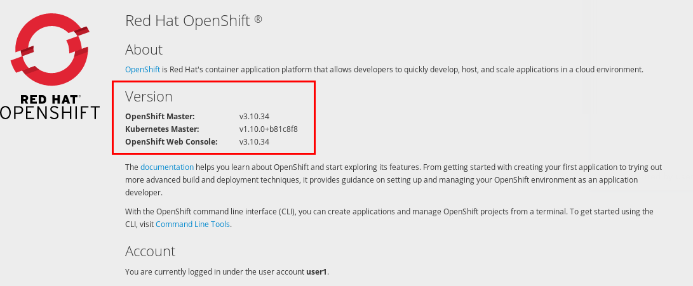
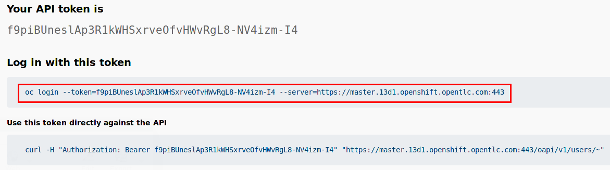

:scrollbar:
:noaudio:
:toc2:
:linkattrs:
:data-uri:

== Environment Setup Lab

.Goals

* Review lab assets
* Become familiar with the multi-tenant Red Hat 3scale API Management lab environment
* Review API gateways

.Prerequisites
* Completion of the following courses:
** link:https://learning.redhat.com/course/view.php?id=739[App Development using Red Hat OpenShift Container Platform]
** link:https://learning.redhat.com/course/view.php?id=977[Red Hat 3scale Implementation]
** link:https://learning.redhat.com/course/view.php?id=1121[Red Hat 3scale Development]

:numbered:

== Local Workstation Setup

=== Install client utilities

For this course, the following client utilities should be installed on your local workstion:

. `curl`
. `openssl`
. `python`
. link:https://stedolan.github.io/jq/[jq]

=== Clone Lab Assets

The lab assets for this course are version-controlled at `https://github.com/gpe-mw-training/3scale_development_labs.git`.

. Clone the lab assets to your local machine as follows:
+
[source,texinfo]
-----
$ mkdir -p $HOME/lab

$ git clone https://github.com/gpe-mw-training/3scale_development_labs.git $HOME/lab/3scale_development_labs
-----

=== Set Environment Variables

. Open a terminal window on your local machine and set the following environment variables for use throughout the duration of this course:
+
-----
# Modify each of the following based on settings provided by Instructor
# Afterwards, execute each of the modified commands in your shell:

echo "export REGION=<provided by your instructor>" >> ~/.bashrc
echo "export OCP_AMP_ADMIN_ID=<provided by your instructor>                          #   Name of 3scale API Management administrator " >> ~/.bashrc
echo "export OCP_USERNAME=<provided by your instructor>" >> ~/.bashrc
echo 'export OCP_PASSWD=<provided by your instructor>' >> ~/.bashrc
echo "export API_TENANT_USERNAME=<provided by instructor>                            #   Name of tenant admin " >> ~/.bashrc
echo "export API_TENANT_PASSWORD=<provided by instructor>                            #   Password of tenant admin " >> ~/.bashrc
echo "export API_ADMIN_ACCESS_TOKEN=<provided by instructor>                         #   Access token specific to tenant to invoke 3scale Admin APIs" >> ~/.bashrc
echo "export SUBDOMAIN_BASE=<provided by instructor>                                 #   SUBDOMAIN Base of OCP " >> ~/.bashrc

#  Review, copy & paste the following in same terminal #

echo "export API_MANAGER_NS=3scale-mt-\$OCP_AMP_ADMIN_ID                                #   Name of OCP namespace where 3scale API Management resides "   >> ~/.bashrc
echo "export GW_PROJECT=\$OCP_USERNAME-gw                                        #   Name of OCP namespace where API gateways resides" >> ~/.bashrc
echo "export API_RESPONSE_DIR=$HOME/lab/api_responses                               #   Name of local directory where responses from invoking 3scale admin API will be stored" >> ~/.bashrc
echo "export OCP_WILDCARD_DOMAIN=apps.\$REGION.\$SUBDOMAIN_BASE                    #   OCP Wildcard DNS" >> ~/.bashrc

# Execute the following to enable the variables in your existing shell
source ~/.bashrc
-----

== Red Hat OpenShift Container Platform

For this course, you use a remote OpenShift(R) cluster environment that was provisioned by your instructor.
All of the labs for this course execute in this remote OpenShift cluster environment.

=== Access Red Hat OpenShift Web Console

. Point your browser to the following URL:
+
[source,texinfo]
-----
$ echo -en "\n\nhttps://console-openshift-console.$SUBDOMAIN_BASE\n\n"
-----
+
NOTE: Reconfirm the OpenShift API URL with your instructor, as the URL and SUBDOMAIN may change for some environments.

. At the login prompt, use the `$OCP_USERNAME` and `$OCP_PASSWD` values.

. Click  and select *About* to determine the OpenShift cluster version:
+

=== Install `oc` Utility Tooling

The OpenShift `oc` client utility needs to be installed on your host laptop.

The version of the `oc` utility needs to be of the same major version as the Red Hat OpenShift Container Platform (RHOCP) shared cluster environment provisioned by your instructor.

If you do not already have a compatible version of the `oc` utility installed on your host machine, you can retrieve it by completing these steps in the OpenShift web console:

. Click  and select *Command Line Tools*.
. Under *Download oc*, click the *Latest Release* link.
* This redirects your browser to a page that allows you to select a specific version for each type of operating system (Linux(R), macOS, or Windows).

. Install the `oc` utility, then log in to OpenShift using it:
+
[source,sh]
----
$ oc login https://api.cluster-$REGION.$REGION.example.opentlc.com:6443 -u $OCP_USERNAME -p $OCP_PASSWD
----
+
NOTE: Reconfirm the OpenShift API URL with your instructor, as the URL and SUBDOMAIN may change for some environments.

.. If your instructor configured your OpenShift environment to use Red Hat SSO as its authentication mechanism (as opposed to the out-of-the-box _htpasswd_ OAuth implementation), then OpenShift will respond with a statement similar to the following:
+
-----
Login failed (401 Unauthorized)
Verify you have provided correct credentials.
You must obtain an API token by visiting https://master.13d11.openshift.opentlc.com:443/oauth/token/request
-----

.. In your browser, navigate to the exact URL specified by OpenShift in the previous statment.
.. In doing so, your browser will be re-directed to the login page of RH-SSO.  Log in using the values of $OCP_USERNAME and $OCP_PASSWD.
.. Copy the oc login command provided, paste into your shell terminal and execute.
+

+
The oc utility in your shell terminal is now authenticated with the master node of your OpenShift lab environment.

=== Verify RHOCP Projects

. After you authenticate, confirm that you see these two OpenShift projects:
+
[source,sh]
-----
$ oc get projects

...

3scale-mt-amp0   3scale-mt-amp0   Active
user1-gw                          Active
-----

* `3scale-mt-amp0`: Your RHOCP user has _view_ access to the central multi-tenant API Manager.

* `$OCP_USERNMAE-gw`: This namespace includes an API gateway that is preconfigured to interact with your 3scale API Management tenant.

== Access Multi-Tenant 3scale API Management

Your lab environment includes access to a multi-tenant 3scale API Management installation.

For the purposes of this lab, you serve as the administrator of your own 3scale API Management _tenant_ (domain).

. Access your 3scale by Red Hat Admin Portal by pointing your browser to the output of the following:
+
[source,texinfo]
-----
$ echo -en "\n\nhttps://$(oc get routes -n $API_MANAGER_NS | grep admin | grep $OCP_USERNAME | awk '{print $2}')\n"
-----

. Authenticate using the following values:

. *Username*:  $API_TENANT_USERNAME
. *Password*:  $API_TENANT_PASSWORD

== Review API Gateways

=== Explore 3scale API Management Gateways

Your 3scale API Management multi-tenant lab environment comes with a set of associated staging and production APIcast gateways.

. Execute the following command to view these gateways:
+
[source,sh]
-----
$ oc get dc -n $API_MANAGER_NS | grep apicast

apicast-production        1          1         1         config,image(amp-apicast:latest)
apicast-staging           1          1         1         config,image(amp-apicast:latest)
-----

It is technically feasible that your back-end services, if they are co-located in the same cluster as the API Manager, can be managed by these default 3scale API Management gateways.

One practical hindrance, however, is that these gateways are owned by the 3scale API Management master user and the RHOCP cluster-admin.
Because you are not a cluster-admin, you do not have the ability to bounce these gateways, or to modify them if need be.

Also, it is difficult to identify your logs while everyone's traffic flows through those gateways at the same time.

These default 3scale API Management gateways are of minimal value to you.

=== Explore Tenant-Specific API Gateways

Your lab environment is provisioned with a set of API gateways that are specific to your tenant.
You have full administrative access to your tenant-specific API gateways.
These are the API gateways that you use to manage your back-end services for the duration of this course.

. Get a list of these API gateways by executing the following command:
+
[source,sh]
-----
$ oc get dc -n $GW_PROJECT

NAME            DESIRED   CURRENT   UP-TO-DATE   AVAILABLE   AGE
prod-apicast    1         0         0            0           7h
stage-apicast   1         0         0            0           7h
-----

* This functionality provides the conveniance of allowing a single OCP wildcard route to manage requests for all your APIs.

. Note that the value of `$THREESCALE_PORTAL_ENDPOINT` is already set for you in `prod-apicast` and `stage-apicast` gateways in a secret:
+
[source,sh]
-----
$ oc get secret apicast-configuration-url-secret -o json -n $OCP_USERNAME-gw | jq ' . | .data.password ' | sed -e 's/^"//' -e 's/"$//' | base64 -d

-----

* The API Gateway uses the value of `THREESCALE_PORTAL_ENDPOINT` to invoke the API Manager and retrieve details of your APIs.
* You can open this secret in the OpenShift console and use _Reveal Secret_ to see the `THREESCALE_ENDPOINT` value.

==== TLS Certificates

. *TLS Certificates*
+
It is likely that your OpenShift lab environment provided by your instructor is enabled with a link:https://community.letsencrypt.org/t/acme-v2-production-environment-wildcards/55578[wildcard TLS certificate] from LetsEncrypt.
Modern HTTP clients (including browsers) include the LetsEncrypt root certificate in their truststore.
+
This wildcard certificate is valid for all OpenShift routes with the following host path: <any string>.$OCP_WILDCARD_DOMAIN.
+
Notice that in the previous consideration, the hosts URLs to be used for the wildcard API router is slightly different:  <any string>.$OCP_USERNAME.$OCP_WILDCARD_DOMAIN.
+
In the case of your wildcard API routes, they will be secured using a self-signed certificate.
Subsequently, when using the wildcard API router, your HTTP clients will have to ignore errors related to unknown certificate authorities. ie;   using the "-k" with the cURL utility.
