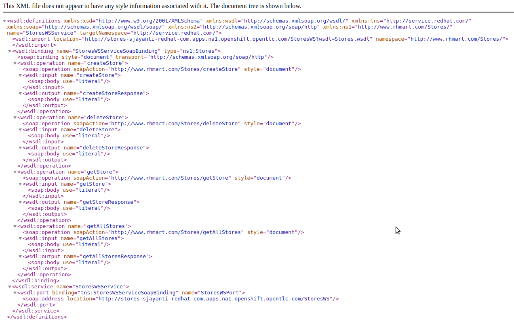
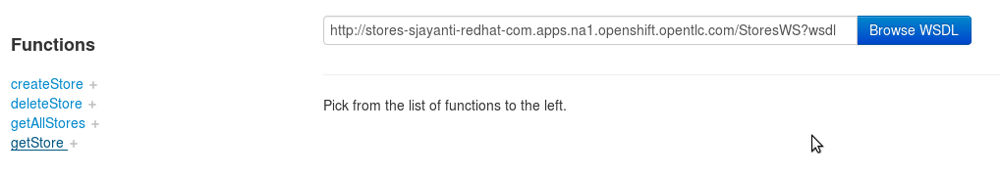
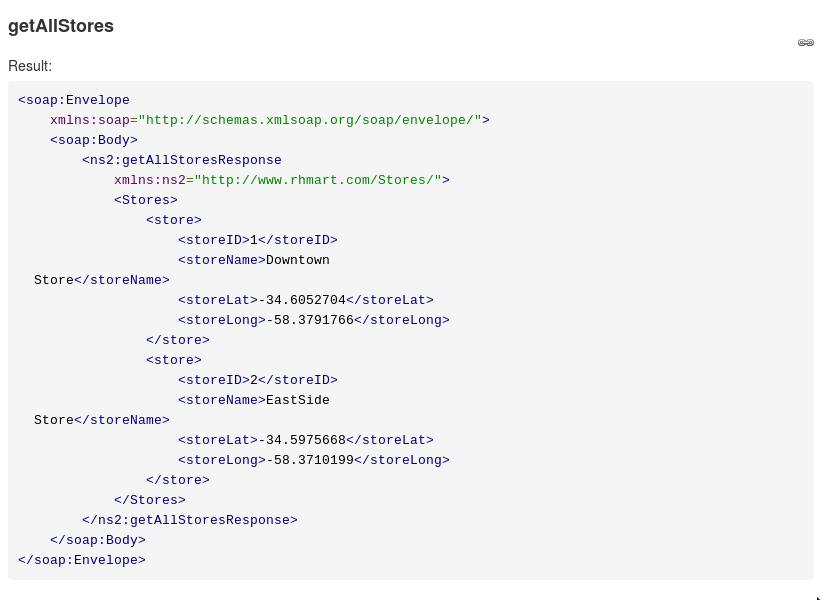
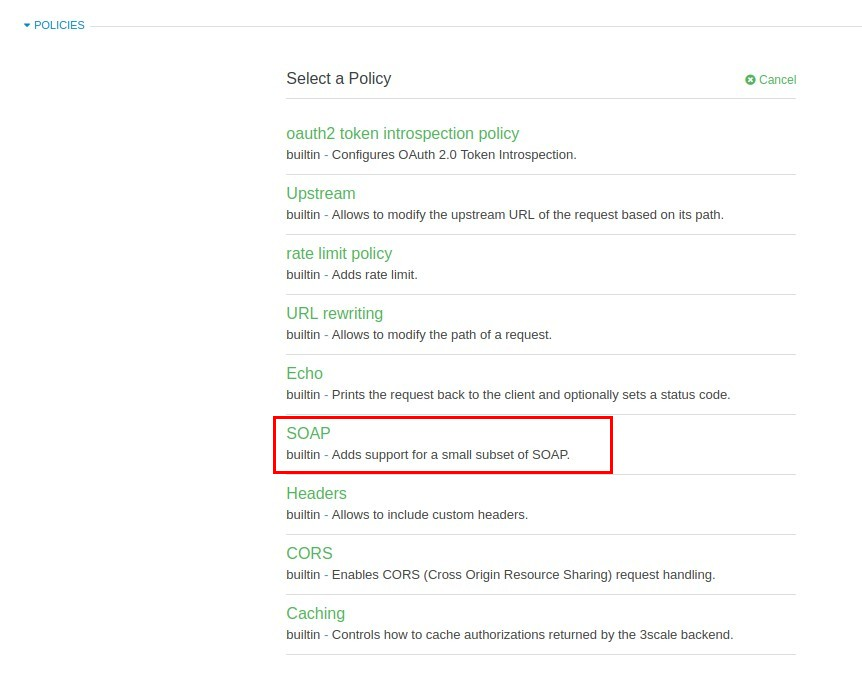
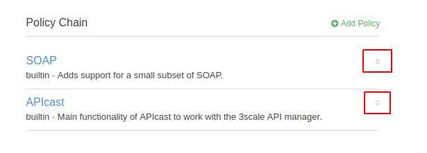
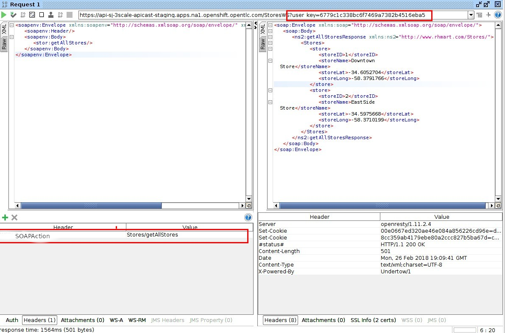
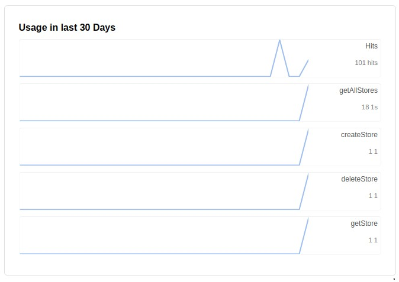
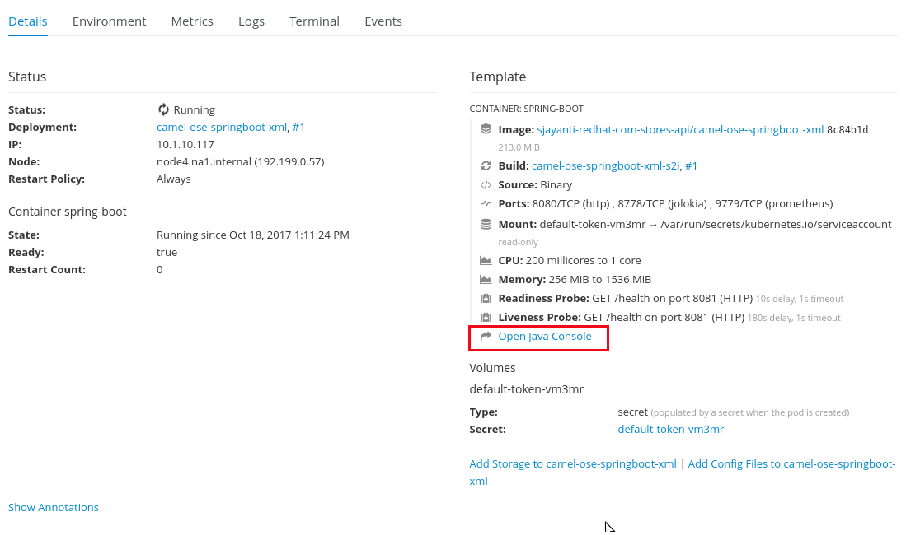
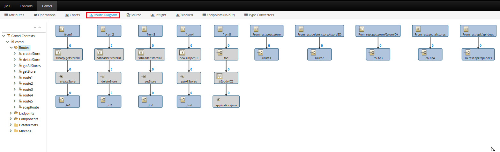

:scrollbar:
:data-uri:
:toc2:
:linkattrs:

== SOAP and OData Service Management Lab

.Goals

* Use Red Hat 3scale API Management's gateway to manage SOAP 1.1 based web services
* Explore two solutions for the management of SOAP based web services:
** SOAP _Policy_ to automatically associate metrics to SOAP operations
** Camel route installed in Red Hat JBoss Fuse Integration Services to route a REST request from 3scale API Management's gateway to a SOAP web service endpoint
* Use 3scale API Management's gateway to connect to OData services

:numbered:

== SOAP Management using SOAP Policy

=== Overview

It is often the case that there will be a requirement to manage SOAP based web services in addition to RESTful web services.

SOAP requests consist of HTTP POST requests with an XML payload and some additional SOAP specific headers.
It is possible for these SOAP requests to be sent to 3scale's API gateway, forwarded to your backend SOAP services and reported on to the 3scale API Manager without any customizations.

However, if there is an additional requirement to gather metrics on requests to specific operations exposed by a backend SOAP service, then some additional set-up is needed.

In this first half of this lab, you experiment with the following two approaches:

. Utilization of the API gateway _SOAP_ policy
. REST-to-XML transformations via a Fuse on OpenShift application
+
This Fuse application serves as a RESTful proxy to the backend SOAP service and transforms between SOAP and REST.

In the second half of this lab, you manage an _OData_ endpoint exposed by JBoss Data Virtualization.

=== SOAP-UI (Recommended)

It is recommended that you install _SOAP-UI_ on your local laptop.

SOAP-UI can optionally be used in later labs of this course when you configure 3scale to manage SOAP based API endpoints.

== SOAP Service Management using API gateway Policy

=== Deploy SOAP Service to OpenShift

In this lab you expose an existing SOAP-based JEE application running on a JBoss Enterprise Application Platform (EAP) container in the same OpenShift cluster as your 3scale API manager.

Follow the instructions below.

. Inspect the SOAP service code:

* In this section you study the `Stores` web service interface and implementation.

.. Open the file `$HOME/lab/3scale_development_labs/Stores/src/main/resources/wsdl/Stores.wsdl`  :
+
[source,xml]
-----
<wsdl:definitions xmlns:soap="http://schemas.xmlsoap.org/wsdl/soap/"

  ...

  <wsdl:portType name="Stores">
    <wsdl:operation name="getAllStores">
      <wsdl:input message="tns:getAllStoresRequest"/>
      <wsdl:output message="tns:getAllStoresResponse"/>
    </wsdl:operation>
    <wsdl:operation name="getStore">
    	<wsdl:input message="tns:getStoreRequest"></wsdl:input>
    	<wsdl:output message="tns:getStoreResponse"></wsdl:output>
    </wsdl:operation>
    <wsdl:operation name="createStore">
    	<wsdl:input message="tns:createStoreRequest"></wsdl:input>
    	<wsdl:output message="tns:createStoreResponse"></wsdl:output>
    </wsdl:operation>
    <wsdl:operation name="deleteStore">
    	<wsdl:input message="tns:deleteStoreRequest"></wsdl:input>
    	<wsdl:output message="tns:deleteStoreResponse"></wsdl:output>
    </wsdl:operation>
  </wsdl:portType>

  ...

</wsdl>
-----

.. Note that this WSDL adheres to the SOAP 1.1 specification.
... The SOAP 1.1 specification defines the following namespace: _http://schemas.xmlsoap.org/wsdl/soap/_
... The SOAP 1.2 specification defines the following namespace: _http://schemas.xmlsoap.org/wsdl/soap12/_
+
NOTE: The two versions of the SOAP specification mandate different mechanisms to invoke SOAP operations defined in its WSDLs.
Later in this lab, the ramifications of the two specifications will become evident in the context of managing SOAP services using 3scale.

.. Open the file `$HOME/lab/3scale_development_labs/Stores/src/main/java/com/redhat/service/StoresWS.java`.
.. Inspect the SOAP web service implementation:
+
[source,java]
-----
@WebService(endpointInterface="com.redhat.service.Stores")
public class StoresWS implements Stores {

        @Inject
        StoreDao storeDAO;

        @Override
        public String createStore(Store store) {
                store = new Store(store.getStoreName(),store.getStoreLat(),store.getStoreLong());
                storeDAO.createStore(store);
                return "Store ID:" + store.getStoreID() + " CREATED";
        }

        @Override
        public String deleteStore(int storeID) {
                storeDAO.deleteStore(storeID);
                return "Store ID: " + storeID + " DELETED";
        }

        @Override
        public Store getStore(int storeID) {
                return storeDAO.getStoreById(storeID);
        }

        @Override
        public StoresType getAllStores() {
                StoresType st = new StoresType();
                st.store = storeDAO.getAll();
                return st;
        }

}
-----

* This service can be deployed on JBoss EAP and hosted on your shared OpenShift environment.

. Deploy the `Stores` web service to OpenShift:

.. Create a new project for your Stores API business service applications:
+
-----
$ oc new-project $OCP_USERNAME-stores-api \
     --display-name="$OCP_USERNAME Stores API" \
     --description="Stores API SOAP Services"
-----

.. Import the `stores-api` template into your OpenShift environment:
+
-----
$ oc create -f $HOME/lab/3scale_development_labs/templates/stores-api.json
-----

.. Create the new application using the `stores-api` template:
+
-----
$ oc new-app --template=stores-soap --param HOSTNAME_HTTP=stores-api-$OCP_USERNAME.$OCP_WILDCARD_DOMAIN
-----

.. Wait a few minutes for the SOAP service to be deployed and for pods to be started, and then run this command:
+
-----
$ oc get pods
NAME                  READY     STATUS      RESTARTS   AGE
stores-soap-1-jnjrb   1/1       Running     0          2m
storesdb-1-6z5lx      1/1       Running     0          12m
-----

=== Test the `Stores` API SOAP service:

. Using the _curl_ utility:
+
At the command line, view the WSDL exposed by the Stores service:
+
-----
$ curl -v http://`oc get route stores-soap -o template --template {{.spec.host}} -n $OCP_USERNAME-stores-api `/StoresWS?wsdl
-----

. Using a browser:
+
NOTE:  There is a known bug with the rendering of WSDLs in recent versions of Firefox.

... Execute the following to determine the URL to the WSDL of your new _Stores_ SOAP service:
+
-----
$ echo -en "\n\nhttp://`oc get route stores-soap -o template --template {{.spec.host}} -n $OCP_USERNAME-stores-api `/StoresWS?wsdl\n\n"
-----

... In a web browser, navigate to the Stores WSDL using the previously determined URL:
+
NOTE: You may encounter a blank screen if using Firefox.  If so, switch to Google Chrome.
+

. Using _wsdlbrowser.com_

... In a new browser tab or window, open the URL link:http://wsdlbrowser.com["http://wsdlbrowser.com"].
... Provide the URL of the Stores WSDL and click *Browse*.
... Check that the WSDL is imported successfully and that the list of functions is displayed on the page:
+

... Click *getAllStores* to generate a sample request for the operation, and then click *Call function*.

* Expect a response similar to the following:
+

=== Create API gateway Staging and Production Routes

Later in this lab, you'll need routes for your staging and production API gateways that are used to proxy traffic to your _Stores_ backend SOAP service.

. Verify that you have gateways in the $GW_PROJECT:
+
-----
$ oc get deploy -n $GW_PROJECT

prod-apicast    1         1         1            1           12m
stage-apicast   1         1         1            1           12m

$ oc get service -n $GW_PROJECT

prod-apicast    ClusterIP   172.30.18.254   <none>        8080/TCP,8090/TCP   1h
stage-apicast   ClusterIP   172.30.47.202   <none>        8080/TCP,8090/TCP   1h
-----

. Create new routes for the Stores API staging and production API gateway:
+
-----
$ oc create route edge stores-soap-policy-staging-route \
  --service=stage-apicast \
  --hostname=stores-soap-staging-apicast-$OCP_USERNAME.$OCP_WILDCARD_DOMAIN \
  -n $GW_PROJECT

$ oc create route edge stores-soap-policy-production-route \
  --service=prod-apicast \
  --hostname=stores-soap-production-apicast-$OCP_USERNAME.$OCP_WILDCARD_DOMAIN \
  -n $GW_PROJECT
-----

TIP: We will be using these routes to be configured as the production and sandbox API endpoints for the Stores SOAP service.

=== Define Account and User

Similar to what you previously did in the 3scale developer pre-req course, you will use an organization called:  `RHBank` with  a developer called:  `rhbankdev`.
The following is a refresher for how to create this account.

. In the 3scale Admin Portal, navigate to  *Audience -> Accounts -> Listing*.
. Click *Create*.
. Create a new account with the following credentials:
* *Username*: `rhbankdev`
* *Email*: `_Provide unique email address_`
* *PASSWORD*: `_Provide unique, easy-to-remember password_`
* *Organization/Group Name*: `RHBank`

=== Define new API

. In the Admin Portal, create a new service:
* *Name*: `Stores SOAP Policy API`
* *System Name*: `stores-soap-policy-api`
* *Description*: `Stores SOAP Policy API`
. Create an application plan for this new _Stores SOAP Policy API_:
* *Name*: `StoresSOAPBasicPlan`
* *System Name*: `storesSOAPBasicPlan`
. Publish the application plan.

. Create an application associated with _RHBank_ account and the _StoresSOAPBasicPlan_ as per the following:
* *Application Plan*: `storesSOAPBasicPlan`
* *Name*: `StoresSOAPApp`
* *Description*: `Stores SOAP Application`

. *Stores SOAP Policy API* integrations
* *Private Base URL*:  Populate with the output of the following:
+
-----
$ echo -en "\n\nhttp://stores-soap.$OCP_USERNAME-stores-api.svc.cluster.local:8080\n"
-----

* *Staging Public Base URL*:  Populate with the output of the following:
+
-----
$ echo -en "\n\nhttps://`oc get route stores-soap-policy-staging-route --template {{.spec.host}} -n $GW_PROJECT`:443\n"
-----

* *Production Public Base URL*: Populate with the output of the following:
+
-----
$ echo -en "\n\nhttps://`oc get route stores-soap-policy-production-route --template {{.spec.host}} -n $GW_PROJECT`:443\n"
-----

. Configure a Method to represent the only HTTP resource exposed by the backend SOAP service:
.. *Friendly name*: StoresWS
.. *system name*: stores/storesws
.. *Description*: Stores SOAP Web Service

. Configure Mapping rules:
+
[options="header"]
|=======================
|Verb|Pattern|Increment|Metric or Method
|`POST`|`/StoresWS`|`1`|`stores/storesws`
|`GET`|`/StoresWS`|`1`|`hits`
|=======================

.. The mapping for the _POST_ requests will increment hits on the _StoresWS_ method every time a SOAP request is made to any of the SOAP _operations_ of your backend _Stores_ service.
.. The mapping for the _GET_ request will increment hits made to resources such as the _Stores_ service's WSDL.

. Configure the metrics:
+
[options="header"]
|=======================
|Metric|System Name|Unit
|`getAllStores`|`Stores/getAllStores`|`hits`
|`createStore`|`Stores/createStore`|`hits`
|`deleteStore`|`Stores/deleteStore`|`hits`
|`getStore`|`Stores/getStore`|`hits`
|=======================
+
These metrics correspond to SOAP _operations_ implemented by your backend SOAP service.

. Set an API Test GET request:
* *API Test GET Request*: `/StoresWS?wsdl`

. Click *Update and test in the Staging Environment*.

=== Test API Managed SOAP service

You should now be able to use a HTTP client to send SOAP requests to your backend SOAP service via the API gateway.

. Test the API by making a `curl` request to the WSDL of the _Stores_ service via the API gateway staging URL:
+
-----
$ export STORES_SOAP_API_KEY=<stores-soap api key>

$ curl -k "https://`oc get route stores-soap-policy-staging-route \
      -o template --template {{.spec.host}} \
      -n $GW_PROJECT`/StoresWS?wsdl&user_key=$STORES_SOAP_API_KEY"
-----

. Make a POST request to the _getAllStores_ operation of the _Stores_ Web Service :
+
-----
$ curl -v -k -X POST \
       --header "Content-Type: application/soap+xml"  \
       --header "Accept: application/soap+xml"  \
       --header "SOAPAction: http://www.rhmart.com/Stores/getAllStores" \
       -d '<soapenv:Envelope xmlns:soapenv="http://schemas.xmlsoap.org/soap/envelope/" xmlns:stor="http://www.rhmart.com/Stores/"><soapenv:Header/><soapenv:Body><stor:getAllStores/></soapenv:Body></soapenv:Envelope>' \
       "https://`oc get route stores-soap-policy-staging-route -o template --template {{.spec.host}} -n $GW_PROJECT`/StoresWS?&user_key=$STORES_SOAP_API_KEY"

-----

.. Notice the inclusion of the _SOAPAction_ header.
.. As per the link:https://www.w3.org/TR/2000/NOTE-SOAP-20000508/#_Toc478383528[SOAP 1.1 specification], an HTTP client *MUST* use this header field when issuing a SOAP HTTP Request.

.. The response should be similar to the following:
+
-----
...
<soap:Envelope xmlns:soap="http://schemas.xmlsoap.org/soap/envelope/">
   <soap:Body>
      <ns2:getAllStoresResponse xmlns:ns2="http://www.rhmart.com/Stores/">
         <Stores>
            <store>
               <storeID>1</storeID>
               <storeName>Downtown
  Store</storeName>
               <storeLat>-34.6052704</storeLat>
               <storeLong>-58.3791766</storeLong>
            </store>
            <store>
               <storeID>2</storeID>
               <storeName>EastSide
  Store</storeName>
               <storeLat>-34.5975668</storeLat>
               <storeLong>-58.3710199</storeLong>
            </store>
         </Stores>
      </ns2:getAllStoresResponse>
   </soap:Body>
</soap:Envelope>
-----

At this point in the lab, you have been able to invoke your backend SOAP 1.1 service via the API gateway proxy.

You could investigate the analytics of your service and view the number hits that have been reported on the _StoresWS_ method.

What you don't know at this time by just observing the analytics dashboard of 3scale is which specific SOAP operations exposed by your SOAP backend have been invoked.

Determining this is the objective of the next section of the lab.

=== SOAP Operation Tracking Using API gateway Custom Policies

In this section, we create a custom API gateway policy for SOAP requests, and use policy chaining to ensure that the custom policy is executed by the gateway.

The custom policy ensures that the metrics are updated for the SOAP operations.

Similar to the previous section of this lab, you continue to use a SOAP 1.1 web service and you continue to make use of the HTTP header called _SOAPAction_ in the requests to that SOAP web service.

These _SOAPAction_ header fields will now be used by your API gateway to update appropriate API metrics.

==== Custom Configuration to handle SOAP requests

. Navigate to *API:Stores SOAP Policy API -> Integration -> Configuration*.
. Click: `Integration -> edit APIcast configuration`.
. Expand the *Policies* section.
. In the *Policy Chain*, click *Add Policy* button and choose *SOAP*.
+

. Under the _Policy Chain_ section, use the up and down arrows to reorder the policies so that *SOAP* policy is first, followed by the *APIcast* policy.
+

. Click on *SOAP* policy to expand it.
. Enter the following mapping rules:
+
[options="header"]
|=======================
|delta|metric_system_name|pattern
|1|`Stores/getAllStores`|`http://www.rhmart.com/Stores/getAllStores`
|1|`Stores/createStore`|`http://www.rhmart.com/Stores/createStore`
|1|`Stores/deleteStore`|`http://www.rhmart.com/Stores/deleteStore`
|1|`Stores/getStore`|`http://www.rhmart.com/Stores/getStore`
|=======================
+
NOTE: The *pattern* should match the *SOAPAction* for each operation. The *metric_system_name* should match the System Name entered for the Metrics of each operation.
+
. Click *Update Policy* to save the changes.
. Click on *Update & test in Staging Environment*.

. Now redeploy the stage-apicast pod in OpenShift by simply deleting the existing one.
Kubernetes will make sure a new one is started.

. Wait for a couple of minutes for the deployment to complete, and the pod to be in `Running` state.
+
-----
$ oc get pods | grep stage-apicast
stage-apicast-5-49cv1           1/1       Running   0          1m
-----

==== Invoke various operations of SOAP service

In this section of the lab, you make more SOAP based invocations to your API gateway.

You will specify the SOAPAction header corresponding to the other `getStore`, `createStore` and `deleteStore` SOAP operations of the Store API.

By doing so, you'll then be able to visualize your invocations to each SOAP operation in the built-in analytics capabilities of 3scale.

. To invoke the other SOAP operations of your Store API, you can continue to use the curl utility (similar to how you previously invoked the _getAllStores_ operation).

. Alternatively, it may be easier to execute the SOAP requests using SOAP-UI.
+
Similar to the _curl_ utility, SOAP-UI allows for setting of the custom _SOAPAction_ header in the http request.
+

+
If you decide to use SOAP-UI, please refer to the appendix of this lab for tips regarding the import of the _Stores_ API WSDL.

. Using either the _curl_ utility or SOAP-UI, make several invocations to each of the four SOAP operations of the _Stores_API_ via your API gateways.
. Observe that the requests are served with correct responses.

==== Analytics

Notice that the metrics you have set up for each operation are captured correctly by the API gateway.
You should see the number of hits corresponding to each SOAPAction that you have requested to the staging endpoint.

==== Management of SOAP 1.2 Web Services

NOTE:  This section is for informational purposes only.

Management of SOAP 1.2 Web Service is similar to the approach you have taken here to manage your SOAP 1.1 _Stores_ Web Service.

What you will want to do different is:

. Do not set a _SOAPAction_ header in your HTTP requests.
. Use the _Content-Type_ header on HTTP requests and set a value for its _action_ parameter

.. The _action_ parameter of the _application/soap+xml_ Content-Type header is specified in link:https://www.w3.org/TR/soap12-part2/#ActionFeature[v1.2 of the SOAP standard]

.. An example using the curl utility is as follows:
+
-----

--header application/soap+xml;charset=UTF-8;action="http://www.rhmart.com/Stores/getAllStores".

-----

==== SOAP Requests to Production Endpoint(Bonus)

Now you can use *Promote to Production* to push the custom policies to the Production API gateway. 
Redeploy the gateway to ensure the latest configuration is updated, and repeat the SOAP requests to production endpoint.

ifdef::showscript[]

-----
curl -v -k -X POST        --header "Content-Type: application/soap+xml"         --header "Accept: application/soap+xml"         --header "SOAPAction: http://www.rhmart.com/Stores/getAllStores"        -d '<soapenv:Envelope xmlns:soapenv="http://schemas.xmlsoap.org/soap/envelope/" xmlns:stor="http://www.rhmart.com/Stores/"><soapenv:Header/><soapenv:Body><stor:getAllStores/></soapenv:Body></soapenv:Envelope>'        "https://`oc get route stores-soap-policy-production-route -o template --template {{.spec.host}} -n $GW_PROJECT`/StoresWS?&user_key=$STORES_SOAP_API_KEY"
-----

endif::showscript[]

== SOAP Transformation Using Fuse on OpenShift

In the previous section of the lab, you observed how 3scale can managed SOAP services.
You also introduced a SOAP policy into your API gateways for gathering of metrics based on SOAP operations.

As an alternative to having 3scale manage SOAP services, you could introduce a _mediation_ layer into your architecture that exposes REST and transforms to SOAP.
An ideal tool for this purpose is JBoss Fuse.

In this section you create a Fuse camel integration to expose a REST endpoint and route to the SOAP service deployed earlier.
The REST endpoint is then configured in 3scale API Management Platform as a service.

==== Deploy `stores fis` application to OpenShift

. If you are not already there, change to the `$OCP_USERNAME-stores-api` project:

. Import the `stores-fis` template to your OpenShift environment:
+
-----
$ oc create -f $HOME/lab/3scale_development_labs/templates/stores-fis.json
-----

. Create a new application using the `stores-fis` template:
+
-----
$ oc new-app --template=stores-fis --param ROUTE_HOST=stores-fis-$OCP_USERNAME.$OCP_WILDCARD_DOMAIN
-----

. Wait a few minutes for the `fis` service to be deployed and for the pods to be started:
+
-----
$ oc get pods
NAME                  READY     STATUS      RESTARTS   AGE
stores-fis-1-ff256    1/1       Running     0          35m
stores-soap-1-jnjrb   1/1       Running     0          1h
storesdb-1-6z5lx      1/1       Running     0          1h
-----

==== Examine the Fuse Mediation Layer:

. Log in to the OpenShift administration console from a web browser using your login credentials.
. Navigate to the `Stores API` project.
. Click the *Stores-FIS* pod, and then click *Open Java Console*:
+

. Click *Route Diagram*.
+
Expect to see all of the Camel routes defined:
+

. Alternatively, click *Source* and look into the Camel route:
+
A REST route is exposed to provide HTTP methods and URLs for the different SOAP operations provided by the Stores API:
+
[source,xml]
-----
    <route id="route1" rest="true">
        <from uri="rest:post::store?routeId=route1&amp;componentName=servlet&amp;inType=com.redhat.service.CreateStore&amp;outType=com.redhat.service.CreateStoreResponse&amp;consumes=application%2Fjson"/>
        <restBinding component="servlet" consumes="application/json" id="restBinding1" outType="com.redhat.service.CreateStoreResponse" type="com.redhat.service.CreateStore"/>
        <to customId="true" id="route1" uri="direct:createStore"/>
    </route>
    <route id="route2" rest="true">
        <from uri="rest:delete::store/{storeID}?routeId=route2&amp;componentName=servlet&amp;outType=com.redhat.service.DeleteStoreResponse"/>
        <restBinding component="servlet" id="restBinding2" outType="com.redhat.service.DeleteStoreResponse"/>
        <to customId="true" id="route2" uri="direct:deleteStore"/>
    </route>
    <route id="route3" rest="true">
        <from uri="rest:get::store/{storeID}?routeId=route3&amp;produces=application%2Fjson&amp;componentName=servlet&amp;outType=com.redhat.service.GetStoreResponse"/>
        <restBinding bindingMode="json" component="servlet" id="restBinding3" outType="com.redhat.service.GetStoreResponse" produces="application/json"/>
        <to customId="true" id="route3" uri="direct:getStore"/>
    </route>
    <route id="route4" rest="true">
        <from uri="rest:get::allstores?routeId=route4&amp;produces=application%2Fjson&amp;componentName=servlet&amp;outType=com.redhat.service.StoresType"/>
        <restBinding bindingMode="json" component="servlet" id="restBinding4" outType="com.redhat.service.StoresType" produces="application/json"/>
        <to customId="true" id="route4" uri="direct:getAllStores"/>
    </route>

-----
+
Note the two GET methods for `getStore` and `getAllStores`, the POST method for `postStore`, and the DELETE method for `deleteStore` operation.

* Each of the `direct` routes corresponds to the four operations defined in the REST service:
+
[source,xml]
-----
   <route customId="true" id="createStore">
        <from customId="true" id="_from1" uri="direct:createStore"/>
        <setBody customId="true" id="_setBody1">
            <simple>${body.getStore()}</simple>
        </setBody>
        <setHeader customId="true" headerName="soapMethod" id="_setHeader1">
            <constant>createStore</constant>
        </setHeader>
        <to customId="true" id="_to1" uri="direct:soap"/>
    </route>
    <route customId="true" id="deleteStore">
        <from customId="true" id="_from2" uri="direct:deleteStore"/>
        <setBody customId="true" id="_setBody2">
            <simple resultType="int">${header.storeID}</simple>
        </setBody>
        <setHeader customId="true" headerName="soapMethod" id="_setHeader2">
            <constant>deleteStore</constant>
        </setHeader>
        <to customId="true" id="_to2" uri="direct:soap"/>
    </route>
    <route customId="true" id="getStore">
        <from customId="true" id="_from3" uri="direct:getStore"/>
        <setBody customId="true" id="_setBody3">
            <simple resultType="int">${header.storeID}</simple>
        </setBody>
        <setHeader customId="true" headerName="soapMethod" id="_setHeader3">
            <constant>getStore</constant>
        </setHeader>
        <to customId="true" id="_to3" uri="direct:soap"/>
    </route>
    <route customId="true" id="getAllStores">
        <from customId="true" id="_from4" uri="direct:getAllStores"/>
        <setBody customId="true" id="_setBody4">
            <mvel>new Object[0]</mvel>
        </setBody>
        <setHeader customId="true" headerName="soapMethod" id="_setHeader4">
            <constant>getAllStores</constant>
        </setHeader>
        <to customId="true" id="_to4" uri="direct:soap"/>
    </route>
-----
+
Each of the routes above gets the request, constructs the CXF request message object, and updates the header to the right `soapMethod` for calling the SOAP web service.

. A route to call the SOAP endpoint:
+
[source,xml]
-----
    <route customId="true" id="soapRoute">
        <from customId="true" id="_from5" uri="direct:soap"/>
        <toD customId="true" id="tod" uri="cxf:bean:wsStores?defaultOperationName=${header.soapMethod}&amp;exchangePattern=InOut"/>
        <setBody customId="true" id="_setBodySoap">
            <simple>${body[0]}</simple>
        </setBody>
        <setHeader customId="true" headerName="Content-Type" id="_setHeaderContextType">
            <constant>application/json</constant>
        </setHeader>
    </route>
-----

. Investigate the property that defines the URL to the backend SOAP service
.. Inspect the properties found in the project's _application.properties_ file:
+
-----
cat $HOME/lab/3scale_development_labs/StoresFIS/src/main/resources/application.properties
-----

.. Notice a property called _cxf.endpoint.soap_ is defined:
+
-----

...

# cxf endpoint address
cxf.endpoint.soap = http://stores-soap:8080

-----

==== Test the Camel REST route:

. Send a `curl` request to the `stores-fis` route to make a call to the REST web service and check that the SOAP web service is called and that the response is converted to `application/json`:
+
-----
$ curl http://`oc get route stores-fis -o template --template {{.spec.host}} -n $OCP_USERNAME-stores-api`/allstores

-----

. Check the response:
+
-----
{"store":[{"storeID":1,"storeName":"Downtown\n  Store","storeLat":-34.6052704,"storeLong":-58.3791766},{"storeID":2,"storeName":"EastSide\n  Store","storeLat":-34.5975668,"storeLong":-58.3710199}]}[sjayanti@localhost camel-webservice-fis]
-----
* You can also send sample requests to the other endpoints and ensure that there are no errors.

The REST-SOAP Camel proxy is now correctly deployed, and you can begin to configure the API gateway to use this REST endpoint to communicate with the SOAP web service.

==== Use Swagger Tool to Import Documents (Optional)

* Follow the steps in the previous lab to import the API documents into 3scale API Management.

==== Create API Staging and Production Routes

. Follow the steps in the API Management lab to create secure routes to the `stage-apicast` and `apicast-production` services for the Stores Transformation API.

. Verify that you are in the apicast gateway project:
+
-----
$ oc project $GW_PROJECT
-----

. Create new routes for the Stores API staging and production API gateway:
+
-----
$ oc create route edge stores-soap-transformation-staging-route \
  --service=stage-apicast \
  --hostname=stores-trans-staging-apicast-$OCP_USERNAME.$OCP_WILDCARD_DOMAIN \
  -n $GW_PROJECT

$ oc create route edge stores-soap-transformation-production-route \
  --service=prod-apicast \
  --hostname=stores-trans-production-apicast-$OCP_USERNAME.$OCP_WILDCARD_DOMAIN \
  -n $GW_PROJECT
-----

==== Configure 3scale API Management

. Create a new service:
* *Name*: `Stores SOAP Transformation API`
* *System Name*: `stores-soap-transformation-api`
* *Description*: `Stores SOAP Transformation API`
. Create an application plan:
* *Name*: `StoresPremiumPlan`
* *System Name*: `storesPremiumPlan`
. Publish the application plan.
. Create a new application for the *RHBank* account that is associated with your _StoresPremiumPlan_.
. Fill in the following information:
* *Application Plan*: `StoresPremiumPlan`
* *Name*: `StoresTransformationApp`
* *Description*: `Stores Transformation Application`

. *Stores SOAP Transformation API* integrations
* *Private Base URL*: 
+
-----
$ echo -en "\n\nhttp://stores-fis.$OCP_USERNAME-stores-api.svc.cluster.local:8080\n"
-----

* *Staging Public Base URL*: 
+
-----
$ echo -en "\n\nhttps://`oc get route stores-soap-transformation-staging-route --template {{.spec.host}} -n $GW_PROJECT`:443\n"
-----

* *Production Public Base URL*: 
+
-----
$ echo -en "\n\nhttps://`oc get route stores-soap-transformation-production-route --template {{.spec.host}} -n $GW_PROJECT`:443\n"
-----

. Create an API Test GET request:
* *API Test GET Request*: `/allstores`
.  Click *Update and test in the Staging Environment*.
. Make a test request to the staging URL.
. Promote to production, and make a test request to the production URL:

.. Test the API by making a `curl` request to the staging URL, and check the response:
+
-----
$ export STORES_TRANS_API_KEY=<api key to your Stores App>

$ curl -k "https://`oc get route stores-soap-transformation-staging-route -o template --template {{.spec.host}} -n $GW_PROJECT`/allstores?user_key=$STORES_TRANS_API_KEY"

{"store":[{"storeID":1,"storeName":"Downtown\n  Store","storeLat":-34.6052704,"storeLong":-58.3791766},{"storeID":2,"storeName":"EastSide\n  Store","storeLat":-34.5975668,"storeLong":-58.3710199}]}

-----

.. Promote the API to production, test the production URL, and check the response:
+
-----
$ curl -v -k "https://`oc get route stores-soap-transformation-production-route -o template --template {{.spec.host}} -n $GW_PROJECT`/allstores?user_key=$STORES_TRANS_API_KEY"

{"store":[{"storeID":1,"storeName":"Downtown\n  Store","storeLat":-34.6052704,"storeLong":-58.3791766},{"storeID":2,"storeName":"EastSide\n  Store","storeLat":-34.5975668,"storeLong":-58.3710199}]}

-----

* A Camel route can be used to provide routing for 3scale API Management's gateway to the SOAP web service.

== OData Service Management

=== Introduction

In this section you deploy an OData(Open Data Protocol) service. link:http://www.odata.org/[OData] is a standard that defines a set of best practices for building and consuming RESTful APIs. The service you deploy is based on a JBoss Data Virtualization for OpenShift Container Platform virtual database (VDB). This VDB has a virtual view that retrieves data from two database tables (MySQL and PostgreSQL) and presents them as a single SQL ANSI table. Then, out of the box, this view is exposed in JBoss Data Virtualization as an OData REST service. You can find more information here:

* link:https://www.redhat.com/en/technologies/jboss-middleware/data-virtualization[JBoss Data Virtualization]

* link:https://access.redhat.com/documentation/en-us/red_hat_jboss_data_virtualization/6.3/html/red_hat_jboss_data_virtualization_for_openshift/[Red Hat JBoss Data Virtualization for OpenShift].

=== Deploy `Stock API` Project to OpenShift

In this section you deploy the Stock API onto a JBoss EAP container running on OpenShift. 
The stock data exists in two databases: MySQL and PostgreSQL. 
JBoss Data Virtualization is used to provide data virtualization and present the combined data view as an OData REST service.

IMPORTANT: When executing commands using the `oc` utility, you must be logged in to the master API of your OpenShift Container Platform environment with your `OCP_USER_ID` credentials.

. At the shell prompt of your VM, verify that you are using the `jboss` user.
. Create a new project for your stock API business service applications:
+
-----
$ oc new-project $OCP_USERNAME-stock-api \
     --display-name="Stock API ODATA" \
     --description="Stock API ODATA Services"
-----

. Import the `stock-api` template to your OpenShift environment:
+
-----
$ oc create -f $HOME/lab/3scale_development_labs/templates/stock-api.json
-----

. Add the `datasources` environment variable secret to the project:
+
-----
$ oc secret new datavirt-app-config $HOME/lab/3scale_development_labs/Stock/datasources.env
-----

. Create a new service account for the `datavirt` user and provide view access:
+
-----
$ oc create serviceaccount datavirt-service-account
$ oc policy add-role-to-user view system:serviceaccount:stock-api:datavirt-service-account
-----

. Create the new application using the `stock-api` template:
+
-----
$ oc new-app --template=stock-api --param HOSTNAME_HTTP=stock-api-$OCP_USERNAME.$OCP_WILDCARD_DOMAIN
-----

. Test the `stock` API service deployed in your OpenShift environment:
+
-----
$ oc get pods
NAME                  READY     STATUS      RESTARTS   AGE
stock-api-2-34b7h     1/1       Running     0          16h
stockmysql-3-3g5v9    1/1       Running     0          18h
stockpg-5-j8181       1/1       Running     0          18h
-----

. Once the API and the database pods are running, test the `odata` service by making a request to the endpoint:
+
-----
$ curl -k http://`oc get route stock-api --template {{.spec.host}} -n $OCP_USERNAME-stock-api`/odata4/Stock-API/FederatedStock/stock?$format=JSON
-----

* Expect a response like the following:
+
[source,JSON]
-----
{"@odata.context":"$metadata#stock","value":[{"productid":1,"amount":20.0,"storeid":1},{"productid":1,"amount":30.0,"storeid":2},{"productid":2,"amount":30.0,"storeid":1},{"productid":2,"amount":14.0,"storeid":2},{"productid":3,"amount":1.0,"storeid":1},{"productid":3,"amount":40.0,"storeid":2},{"productid":4,"amount":14.0,"storeid":1},{"productid":4,"amount":100.0,"storeid":2},{"productid":5,"amount":22.0,"storeid":1},{"productid":5,"amount":2.0,"storeid":2},{"productid":6,"amount":880.0,"storeid":1},{"productid":6,"amount":10.0,"storeid":2},{"productid":7,"amount":1200.0,"storeid":1},{"productid":7,"amount":32.0,"storeid":2},{"productid":8,"amount":532.0,"storeid":1},{"productid":8,"amount":1.0,"storeid":2},{"productid":9,"amount":10.0,"storeid":1},{"productid":9,"amount":123.0,"storeid":2},{"productid":10,"amount":1.0,"storeid":1},{"productid":10,"amount":730.0,"storeid":2}]}[sjayanti@localhost camel-webservice-fis]
-----

* The REST `odata` service is now correctly deployed, and you can now begin to configure the API gateway to use this REST endpoint to communicate with the service.

=== Create API Gateway Staging and Production Routes

Follow the steps in the API Management lab to create secure routes to the `stage-apicast` and `apicast-production` services for the Stock API.

. Verify that you are in the API gateway project:
+
-----
$ oc project $GW_PROJECT
-----
+
. Create new routes for the Stock API staging and production API gateway:
+
-----
$ oc create route edge stock-odata-staging-route \
  --service=stage-apicast \
  --hostname=stock-odata-staging-$OCP_USERNAME.$OCP_WILDCARD_DOMAIN \
  -n $GW_PROJECT

$ oc create route edge stock-odata-production-route \
  --service=prod-apicast \
  --hostname=stock-odata-production-$OCP_USERNAME.$OCP_WILDCARD_DOMAIN \
  -n $GW_PROJECT
-----

=== Configure 3scale API Management

. In the Admin Portal, create a new service:
* *Name*: `Stock OData API`
* *System Name*: `stock-odata-api`
* *Description*: `Stock OData API`

. Create an application plan:
* *Name*: `StockODataPremiumPlan`
* *System Name*: `stockODataPremiumPlan`
. Publish the application plan.

. Create a new application for the *RHBank* account that is associated to the *StockODataPremiumPlan*.
. Click *Applications* and then click *Create Application*:
* *Application Plan*: `StockODataPremiumPlan`
* *Name*: `StockODataApp`
* *Description*: `Stock OData Application`

. *Stock OData API* integrations
* *Private Base URL*: 
+
-----
$ echo -en "\n\nhttp://stock-api.$OCP_USERNAME-stock-api.svc.cluster.local:8080\n"
-----

* *Staging Public Base URL*: 
+
-----
$ echo -en "\n\nhttps://`oc get route stock-odata-staging-route --template {{.spec.host}} -n $GW_PROJECT`:443\n"
-----

* *Production Public Base URL*: 
+
-----
$ echo -en "\n\nhttps://`oc get route stock-odata-production-route --template {{.spec.host}} -n $GW_PROJECT`:443\n"
-----

. Create a mapping rule:
* *Operation*: `GET`
* *Pattern*: `/odata4/Stock-API/FederatedStock/stock`
. Create API Test GET request:
* *API Test GET Request*: `/odata4/Stock-API/FederatedStock/stock?$format=JSON`
.  Click *Update and test in the Staging Environment*.
. Make a test request to the staging URL.
. Promote to production and make a test request to the production URL.

== Appendix

=== SOAP UI Related Hints

When creating a SOAP based project in SOAP-UI, you'll need to provide the wsdl to your Store service.
This can be a bit problematic.

You won't be able to simply supply SOAP-UI with a valid URL (with API key) to your Store service WSDL.
SOAP-UI will pull down that initial wsdl, parse it for the value of <wsdl:import location= />  attribute and error out because the value of the location attribute is not complete".  It is missing your API key.

Subsequently, you'll want to execute the following:

. Use curl to retrieve a copy of your wsdl and save that copy to disk
. Using a text editor, change the value of the <wsdl:import location="" /> attribute to a valid URL to your wsdl.
.. You will want to url encode the ampersand character in the URL
.. Example as follows:
+
-----
<wsdl:import location="https://stores-soap-staging-apicast-jb.apps.dev39.openshift.opentlc.com/StoresWS?wsdl=Stores.wsdl&amp;user_key=4fab352901d3badef8cbe9e05eab1271" namespace="http://www.rhmart.com/Stores/">
-----
. Create a new SOAP project in SOAP-UI by referencing this downloaded and modified local wsdl.

ifdef::showscript[]

oc edit is fis-java-openshift -n openshift

endif::showscript[]
