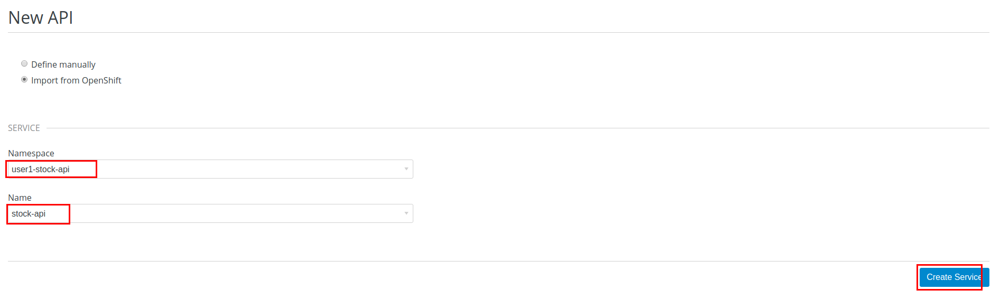
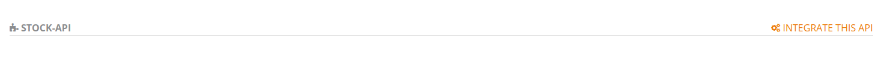

:scrollbar:
:data-uri:
:toc2:
:linkattrs:

== SOAP and OData Service Management Lab

.Goals

* Use 3scale Service Discovery to discover an OData service running on OpenShift
* Use 3scale API Management's gateway to connect to OData services

:numbered:

== OData Service Management

=== Introduction

In this section you deploy an OData(Open Data Protocol) service. link:http://www.odata.org/[OData] is a standard that defines a set of best practices for building and consuming RESTful APIs. The service you deploy is based on a JBoss Data Virtualization for OpenShift Container Platform virtual database (VDB). This VDB has a virtual view that retrieves data from two database tables (MySQL and PostgreSQL) and presents them as a single SQL ANSI table. Then, out of the box, this view is exposed in JBoss Data Virtualization as an OData REST service. You can find more information here:

* link:https://www.redhat.com/en/technologies/jboss-middleware/data-virtualization[JBoss Data Virtualization]

* link:https://access.redhat.com/documentation/en-us/red_hat_jboss_data_virtualization/6.3/html/red_hat_jboss_data_virtualization_for_openshift/[Red Hat JBoss Data Virtualization for OpenShift].

=== Deploy `Stock API` Project to OpenShift

In this section you deploy the Stock API onto a JBoss EAP container running on OpenShift. 
The stock data exists in two databases: MySQL and PostgreSQL. 
JBoss Data Virtualization is used to provide data virtualization and present the combined data view as an OData REST service.

IMPORTANT: When executing commands using the `oc` utility, you must be logged in to the master API of your OpenShift Container Platform environment with your `OCP_USER_ID` credentials.

. At the shell prompt of your VM, verify that you are using the `jboss` user.
. Create a new project for your stock API business service applications:
+
-----
$ oc new-project $OCP_USERNAME-stock-api \
     --display-name="Stock API ODATA" \
     --description="Stock API ODATA Services"
-----

. Import the `stock-api` template to your OpenShift environment:
+
-----
$ oc create -f $HOME/lab/3scale_development_labs/templates/stock-api.json
-----

. Add the `datasources` environment variable secret to the project:
+
-----
$ oc secret new datavirt-app-config $HOME/lab/3scale_development_labs/Stock/datasources.env
-----

. Create a new service account for the `datavirt` user and provide view access:
+
-----
$ oc create serviceaccount datavirt-service-account
$ oc policy add-role-to-user view system:serviceaccount:$OCP_USERNAME-stock-api:datavirt-service-account
-----

. Create the new application using the `stock-api` template:
+
-----
$ oc new-app --template=stock-api --param HOSTNAME_HTTP=stock-api-$OCP_USERNAME.$OCP_WILDCARD_DOMAIN
-----

. Test the `stock` API service deployed in your OpenShift environment:
+
-----
$ oc get pods
NAME                  READY     STATUS      RESTARTS   AGE
stock-api-2-34b7h     1/1       Running     0          16h
stockmysql-3-3g5v9    1/1       Running     0          18h
stockpg-5-j8181       1/1       Running     0          18h
-----

. Once the API and the database pods are running, test the `odata` service by making a request to the endpoint:
+
-----
$ curl -k http://`oc get route stock-api --template {{.spec.host}} -n $OCP_USERNAME-stock-api`/odata4/Stock-API/FederatedStock/stock?$format=JSON
-----

* Expect a response like the following:
+
[source,JSON]
-----
{"@odata.context":"$metadata#stock","value":[{"productid":1,"amount":20.0,"storeid":1},{"productid":1,"amount":30.0,"storeid":2},{"productid":2,"amount":30.0,"storeid":1},{"productid":2,"amount":14.0,"storeid":2},{"productid":3,"amount":1.0,"storeid":1},{"productid":3,"amount":40.0,"storeid":2},{"productid":4,"amount":14.0,"storeid":1},{"productid":4,"amount":100.0,"storeid":2},{"productid":5,"amount":22.0,"storeid":1},{"productid":5,"amount":2.0,"storeid":2},{"productid":6,"amount":880.0,"storeid":1},{"productid":6,"amount":10.0,"storeid":2},{"productid":7,"amount":1200.0,"storeid":1},{"productid":7,"amount":32.0,"storeid":2},{"productid":8,"amount":532.0,"storeid":1},{"productid":8,"amount":1.0,"storeid":2},{"productid":9,"amount":10.0,"storeid":1},{"productid":9,"amount":123.0,"storeid":2},{"productid":10,"amount":1.0,"storeid":1},{"productid":10,"amount":730.0,"storeid":2}]}[sjayanti@localhost camel-webservice-fis]
-----

* The REST `odata` service is now correctly deployed, and you can now begin to configure the API gateway to use this REST endpoint to communicate with the service.

== 3scale Service Discovery 

In order for any OpenShift service to be discoverable by 3scale API Manager running on the same OpenShift cluster, the `default` service account of the 3scale API Manager namespace needs view access to the cluster. 

In your lab environment, this has already been provisioned for you by the administrator.
For details on the new Service Discovery feature of 3scale, please refer to this document: https://access.redhat.com/documentation/en-us/red_hat_3scale_api_management/2.4/html-single/service_discovery/index

=== Set up OData Service for Discovery

. Edit the service *stock-api* in the OpenShift project *$OCP_USERNAME-stock-api*.
+
----
oc edit svc stock-api
----

. Add the following line under labels:
+
----
    discovery.3scale.net: "true"
----

. Add the following lines under *annotations*:
+
----
    discovery.3scale.net/description-path: 
    discovery.3scale.net/path: 
    discovery.3scale.net/port: "8080"
    discovery.3scale.net/scheme: http

----

. Save the changes.

== Create API Gateway Staging and Production Routes

Follow the steps in the API Management lab to create secure routes to the `stage-apicast` and `apicast-production` services for the Stock API.

. Verify that you are in the API gateway project:
+
-----
$ oc project $GW_PROJECT
-----
+
. Create new routes for the Stock API staging and production API gateway:
+
-----
$ oc create route edge stock-odata-staging-route \
  --service=stage-apicast \
  --hostname=stock-odata-staging-$OCP_USERNAME.$OCP_WILDCARD_DOMAIN \
  -n $GW_PROJECT

$ oc create route edge stock-odata-production-route \
  --service=prod-apicast \
  --hostname=stock-odata-production-$OCP_USERNAME.$OCP_WILDCARD_DOMAIN \
  -n $GW_PROJECT
-----

== Configure 3scale API Management

=== Discovery

. From the 3scale Admin console home page, click on *New API*.
. Select *Import from OpenShift*
. Select the namespace *$OCP_USERNAME-stock-api*
. Select the Name *stock-api*.
. Click on *Create Service*.
+

. The service will be imported within a few minutes and appear in the list of integrations.
+

. Click on *Integrate this API*.

. Create an application plan:
* *Name*: `StockODataPremiumPlan`
* *System Name*: `stockODataPremiumPlan`
. Publish the application plan.

. Create a new application for the *RHBank* account that is associated to the *StockODataPremiumPlan*.
. Click *Applications* and then click *Create Application*:
* *Application Plan*: `StockODataPremiumPlan`
* *Name*: `StockODataApp`
* *Description*: `Stock OData Application`

. *stock-api* integrations
* *Private Base URL*: already imported from the service.

* *Staging Public Base URL*: 
+
-----
$ echo -en "\n\nhttps://`oc get route stock-odata-staging-route --template {{.spec.host}} -n $GW_PROJECT`:443\n"
-----

* *Production Public Base URL*: 
+
-----
$ echo -en "\n\nhttps://`oc get route stock-odata-production-route --template {{.spec.host}} -n $GW_PROJECT`:443\n"
-----

. Create a mapping rule:
* *Operation*: `GET`
* *Pattern*: `/odata4/Stock-API/FederatedStock/stock`
. Create API Test GET request:
* *API Test GET Request*: `/odata4/Stock-API/FederatedStock/stock?$format=JSON`
.  Click *Update and test in the Staging Environment*.
. Make a test request to the staging URL.
. Promote to production and make a test request to the production URL.

ifdef::showscript[]

oc edit is fis-java-openshift -n openshift

endif::showscript[]
