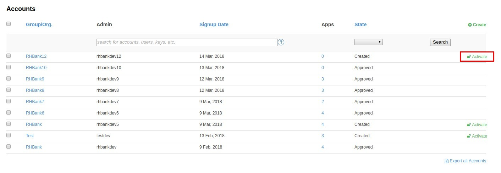

:scrollbar:
:data-uri:
:toc2:
:linkattrs:

== Custom Signup Flows Lab

In this lab you create custom signup flows for managing various signup approaches for API consumers of your APIs managed through 3scale. 
Several signup scenario flows are covered in this lab to include: _single application sign-up_,  _multiple application signups_, and _group membership_.

.Goals
* Create API documentation for the Products API application
* Integrate the API documentation with 3scale API Management
* Create a custom development portal
* Create a client application to call the Products API

:numbered:

== Introduction

Please read this excellent article from Kevin Price on 3scale signup and signup flows.

https://developers.redhat.com/blog/2017/12/18/3scale-developer-portal-signup-flows/

In this lab, we will be following the 4 examples discussed in the blog and adapt it to the services and APIs managed here.

The sign-up flow that you (as an API Provider) select and implement in your production environment to onboard API Consumers is a function of several considerations.   
These considerations include the following:

. Are API services available to all API consumers or should they be made available per group ?
. Should any of your API services be made available to non-registered API consumers ?
. Are there different application plans for each service ?

== Save Original Signup Flow as a _Partial_

=== Overview

The out-of-the-box _Homepage_ found in the 3scale _Content Management System_ (CMS) (and gets rendered to API consumers in the Developer Portal) includes a very simple sign-up flow embedded in it.

In this section of the lab, you extract that embedded sign-up flow and save it as a _Partial_.
You then reference that new partial in your _Homepage_.

Because you are just moving the original sign-up flow logic from being buried in the _Homepage_ to being a referenced _partial_, no change to the look and feel of your Developer Portal is to be expected.

In later sections of this lab, you will implement more sophisticated sign-up flows that are also implemented as _partials_ .
All of your sign-up flows can easily be swapped in and out of the Developer Portal homepage simply by changing the reference to the desired partial.

You will then be able to compare and contrast the features and behavior of each of these partials.

=== Procedure

. From the 3scale Admin Portal, navigate to _Audience -> Developer Portal_.  Doing so will expand links related to the CMS.
. In the left panel, click: `Content`.  Observe the default look-n-feel of the CMS homepage.
. In the left panel, click: _Visit Portal_
+
Make note of the default look-n-feel of the Developer Portal along with its focus on the _Echo API_.

. In the CMS, navigate to: *My -> Root -> Homepage*:
. Cut out lines 119 - 182 from the _Homepage_.  Save the change.
. From the blue drop-down selection at the top-right, click _New Partial_.
+
image::images/click_new_partial.png[]

. Set the _System name_ of the New partial as: _original_app_signup_form_ .
. Paste was previously deleted from the Homepage into the the large text box of your new _original_app_signup_form_ partial.
. Click:  Create Partial
. Return back to the Homepage and enter the following at line 119:
+
-----
<section class="plan">
    
</section>
-----
+

.. Save the _Homepage_ file.

. Publish both the changes.
+
In the left panel, click _Drafts_ and then "Publish All"
+

. Click on *Developer Portal* again and ensure nothing has changed.

. Answer the following questions:

.. Why is only one API service being displayed in the Developer Portal ?
.. What is the _system_name_ of that API service ?

ifdef::showscript[]

. 
. api

endif::showscript[]

== Single Application Signup flow

=== Overview

This is the simplest signup flow.
It only allows a subscription to a single Service and Application Plan upon account creation.

This signup flow is actually very similar to the original sign-up flow you saved as a _partial_ in the previous section of this lab.

The only difference between this signup flow and the original is :

. The original partial is focused specifically on the sample _Echo_ API that comes out of the box with a fresh install of the product.
. This _single-app_ sign up flow used in this section iterates through the application plans of all services from the provider account.
+
The API consumer is allowed to sign-up for 1 of the possible many application plans displayed.

You do not need to enable any special features in the 3scale Developer portal to use this flow.

The signup flow is provided in the partial *~/lab/3scale_development_labs/DevPortal/_single_app_signup_form.html.liquid*.

=== Procedure

. Open the file *~/lab/3scale_development_labs/DevPortal/_single_app_signup_form.html.liquid* and examine the code for the signup:
.. Service/Application filter
+
----
            
      		<h2> {{ service.name }} </h2>
      		

            
----
+
NOTE: The above liquid filter iterates through the list of all services for the provider, and then further iterates through all the application plans. 
Thus, this filter allows you to display a list of all services along with the service plans.
+
.. Plan Features/Limits
+
----
    

        <article class="panel panel-default">
            

                <strong>{{ plan.name }}</strong>
            

            

                

                    
                    

                        <h5>Features</h5>
                        <ul class="features list-unstyled">
                            
                            <li>
                                <i class="fa fa-check"></i> {{ feature.name }}
                            </li>
                            
                        </ul>
                    

                    
                    

                        <h5>Limits</h5>
                        <ul class="limits list-unstyled">
                             
                            <li>
                                <i class="fa fa-signal"></i> {{ limit.metric.name }} &ndash; {{ limit.value }} {{ limit.metric.unit }}s per {{ limit.period }}
                            </li>
                             
                            <li>
                                <i class="fa fa-signal"></i> No limits
                            </li>
                            
                        </ul>
                    

                

            

----
+
NOTE: The above code displays the plan name and features/limits setup for the plan.
+
.. Signup link
+
----
                   <a class="btn btn-cta-secondary pull-right" href="{{ urls.signup }}?{{ plan | to_param }}&{{ service.service_plans.first | to_param }}">Signup to plan {{ plan.name }}</a>

----
+
NOTE: This section shows the link to redirect to the signup form for the chosen plan and service.
+
. Add this partial to the developer portal.
.. click on *New Partial*
.. Provide System name as:  *single_app_signup_form*
.. Copy the contents of the file *~/lab/3scale_development_labs/DevPortal/_single_app_signup_form.html.liquid* into the text field.
.. Click on *Create Partial*.
.. Confirm that the partial shows up in the menu list of partials.
+

. Edit the *Homepage*:
.. At around line 120, replace _original_app_signup_form_ with _single_app_signup_form_.
+
....
  <section class="plan">
    
  </section>

....
+
NOTE: The include ensures the content of the partial is included to be displayed in the Homepage.
+
.. Save the file.
. Publish both the changes.
+

=== Test
. Navigate to the Developer Portal and ensure you are currently logged out.
. Verify that the Homepage now displays all API services and application plans created in previous labs:
+
image::images/3scale_amp_custom_signup_single_plan_3.png[]
+
. Now sign up using the form by clicking on one of the plans.
+
Notice that you are only allowed to select the link to a single application plan at a time.

. Fill up the form with a new user details and a valid email address.
+
image::images/3scale_amp_custom_signup_single_plan_4.png[]
+
. Once signup is successful, you will get a Success page.
+

+
. Look for the email to the email address provided.
+

+
. Click on the *activate your account* link and sign in with the username/password used to create the account.
. Finally, in the admin portal click on the *Developers* tab, check that the Account & user are created.
+

== Multiple Application Signup Flow

=== Overview
The multiple application signup flow allows users to signup for multiple services (and the associated application plans) at the same time.

It does so by providing a _partial_ that renders a multi-select check box HTML form in the Developer Portal.

In addition, the *Multiple Applications* feature needs to be enabled in the Developer Portal.

=== Procedure

. Login to the admin portal using your credentials and navigate to *Developer Portal*.
. Click on *Feature Visibility*.
. Ensure that the *Multiple Applications* feature is *_visible_*.
+
image::images/3scale_amp_custom_signup_multi_plan.png[]

The signup flow is provided in the partial *~/lab/3scale_development_labs/DevPortal/_multiple_app_signup_form.html.liquid*.

. Open the file *~/lab/3scale_development_labs/DevPortal/_multiple_app_signup_form.html.liquid* and examine the code for the signup:
. You will notice that the form is quite similar to the *_single_app_signup_form.html.liquid*. Specific to this _partial_, of interest is the following:
.. The signup form:
+
----
<form action="{{ urls.signup }}" method="get">
----
+
.. checkbox input:
+
----
<input type="checkbox" name="plan_ids[]" value="{{ plan.id }}">Signup to {{ plan.name }}</input>
<input type="hidden" name="plan_ids[]" value="{{ service.service_plans.first.id }}"></input>

----
+
.. A submit button to direct to the Signup form.
+
----
    <button type="submit" class="btn btn-cta-primary">Signup</a>
----
+
. Upload the partial to the Developer Portal.
.. System name* : *multi_app_signup_form*
.. Copy the contents of the file *~/lab/3scale_development_labs/DevPortal/_multiple_app_signup_form.html.liquid* and click on *Create Partial*.
. Ensure the partial shows up in the menu.
. Edit the *Homepage* and change the include section to use the *multi_app_signup_form* instead of *single_app_signup_form*.
. Now save and *Publish* the changes.

=== Test
. Navigate to the Developer Portal and ensure you are currently logged out.
. Notice the home page now has the multiple signup form, with a checkbox for each application plan.
+
image::images/3scale_amp_custom_signup_multi_plan_3.png[]
+
. Try to signup for 2 different applications (e.g API Unlimited and ProductsBasicPlan).
. In the signup form, provide an appropriate email address and user details.
. Click on the link in the confirmation email and login.
. Login as the new user and notice the ability to view all registered Application and Keys created for those chosen applications.
+
image::images/apps_and_creds.png[]

. Finally, in the admin portal click on the *Developers* tab, check that the Account & user are created.
+
image::images/3scale_amp_custom_signup_multi_plan_5.png[]
+
NOTE: Note that if there are any services with default application plans, then a default application is created for the account created using the signup form. 
In order to prevent this, do NOT mark any application plan as default in the service specification.

== Custom Field Flow

=== Overview

With this flow, a custom _field_ on the API consumer accounts is used to control the services those API consumers can see and subscribe to. 

A typical usecase is if there are multiple application plans each with different access (e.g a different plan for internal developers and another for external developers). 
This field can be combined with the *Account Approval* feature so that an admin can view and approve the user to a particular service.

In this sign-up flow use case, we will utilize two of the _Stores_ related APIs that you have created in previous labs.

. *Stores SOAP Policy API*
+
Manages SOAP services and introduces a custom SOAP policy to track metrics per SOAP operation.
+
In this scenario, we will make this *internal* and only available to API consumers who are signed up as _internal_ users. 

. *Stores SOAP Transformation API*
+
Uses JBoss Fuse as a REST to SOAP XML mediation layer.
+
In this scenario, this endpoint could be made available to API consumers who are signed up as _public_ users. 
+
We will also restrict *public* users to have an Account Approval required, so that before they could access the Stores Transformation API, an admin user will approve their request.

The below steps are required to accomplish this _Custom Field Flow_.

=== Set up custom field on *Accounts*

Let's start by defining the custom field on the API consumer *Accounts* object.

. Open the Admin Portal and navigate to: *Audience -> Accounts -> Fields Definitions* tab.
. Click on the *Create* link in the Account field.
+

. Enter the following values:
.. *Name*: access
.. *Label*: access
.. Do not check any of the *Required*, *Hidden* or *Read Only*.
.. *Choices*: internal, public
+
image::images/3scale_amp_custom_signup_field_plan_2.png[]

... Note that the field could be made *Required* so that any user signup will contain this field. 
Another usecase is to make it a *Hidden* field, and have a simple javascript provide its value (e.g depending on user's email address). 
This field can also be made *Read Only* such that it cannot be changed by the API consumers, only by the API provider tenant admin.
... In our scenario, we leave all of these options unchecked so that upon sign-up, the user can see this field and optionally decide whether to gain access to either an _internal_ or _public_ API.

. Click `Create`, and check that the field is successfully added to the Account object.
+
image::images/3scale_amp_custom_signup_field_plan_3.png[]

=== Enable Account Approval
It is possible to require that an API provider approve and activate all accounts initiated by API consumers.

Please enable this feature now by executing the following:

. As an API provider, navigate to the following in the Admin Portal: `Audience -> Accounts -> Usage Rules -> Signup`
. Click the checkbox: `Account approval required`
. Click `Update Settings`

This feature will be used in both this custom signup flow as well as the next one introduced in this lab:  _Group Membership Signup_.

=== Changes to APIs and Application Plans

In this section, a custom _feature_ will be defined for two of your API services:  _Stores SOAP Policy API_ and _Stores Transformation API_.

The values (_internal_ and _public_ ) of these _features_ correspond to the values of the previously created _field_ defined for all API consumer _accounts_.

==== Stores SOAP Policy API

. Navigate to the  *Settings* for the Stores SOAP Policy API, and select *default* plan, enable the option: *Developers can select a plan when creating a new application*.
+
image::images/3scale_amp_custom_signup_field_plan_10.png[]
+
. Click on *Update Service*.

. Navigate to the _StoresSOAPBasicPlan_ Application Plan of the *Stores SOAP Policy API*.
. Create a *New Feature* with following values:
.. *Name* : internal
.. *System name* : internal
.. *Description* : This Plan is intended for internal users.
. Click on *Save*
+
image::images/3scale_amp_custom_signup_field_plan_4.png[]
+
. Click on the *x* under *Enabled?* to enable the feature.

==== Stores Transformation API

. For the *default* plan of the _Stores Transformation API_, enable the option:  *Developers can select a plan when creating a new application*.
. Navigate to the *StoresTransPremiumPlan* of the *Stores SOAP Transformation API*.
. Select the checkbox for *Application require approval?*
. Create a new feature for this plan with the following values:
.. *Name* : public
.. *System name* : public
.. *Description* : This Plan is intended for public users.
. After saving the new feature, enable it.
 

=== Developer Portal changes

Two _partials_ will be be specified in the _Homepage_.

The first new partial renders in the Dev Portal for unauthenticated users.
The second new partial renders in the Dev Portal only after the API consumer has registered a new account and authenticated in.

. Add the partial *unauthenticated_noplan_signup_form* with the contents of the file: *~/lab/3scale_development_labs/DevPortal/_unauthenticated_noplan_signup_form.html.liquid*
. In the *Homepage*, modify the include statement at around line 123 
+
----

----
+
This partial is rendered for unauthenticated users.
Notice that is simply provides a link to the registration page.

. Add the partial *custom_field_signup_form* with the contents of the file *~/lab/3scale_development_labs/DevPortal/_custom_field_plans.html.liquid*
. In the *Homepage*, add the following after line 87 (before the ** line).
+
----

----
+
This partial is rendered for authenticated API consumers.
Notice that the partial contains logic to iterate through the list of services and application plans.
It  then offers to the API consumer the ability to register for only those plans available as per the custom account field .

. Save and publish all the changes.

=== Test the Custom Field flow for *Public* access

. Navigate to the Developer Portal and ensure you are currently logged out.
. Click the link provided by your _unauthenticated_noplan_signup_form_:
+
image::images/noplan_signup.png[]

. Provide new user details (with a valid email address).
. Select *ACCESS* to be *public*.
. Click on *Sign up*.
+

+
. Navigate to the *Developers* tabs and note the new account is created.
+
image::images/3scale_amp_custom_signup_field_plan_8.png[]
+
NOTE: Note that even if no application is selected during signup, new _applications_ (derived from the *default* application plan) for each service are created for each account.

. Now activate the user by clicking on the activation link in the email.
. Login as the new user created to the Developer Portal.
. Note the Homepage after sign-in shows the *public* plan for the user to subscribe.
+
image::images/3scale_amp_custom_signup_field_plan_9.png[]
+
. Click on *Signup to plan StoresTransPremiumPlan* link.
. Provide a name and descrption for the new plan and then click: *Create Application*

. Note the success page shows the application *Pending Approval*.
+
image::images/3scale_amp_custom_signup_field_plan_12.png[]

. As the API provider, navigate in the Admin Portal to the newly created application and notice its current status of: _pending_.
. Click on *Accept* to accept the application.
+
image::images/3scale_amp_custom_signup_field_plan_13.png[]

=== Test the Custom field flow for *Internal* access

Repeat the steps from the above section to create a user with *internal* access, and ensure that you can subscribe the user to the *StoresSOAPBasicPlan*.

== Group Membership Flow

=== Overview

Group Membership flow is especially useful when you want to control the access to Services and not just the application plans.
If you want to specify _sections_ of HTML content that API consumers can only access when they have the correct permissions then you should use this flow.

Our usecase for this lab will be similar to the last lab on _custom field signup_. 
Instead of relying on application plans for *internal* and *public* user signup, we will restrict signup access to the API services that an API consumer has been granted access to by an API provider.
The mechanisms for doing so will be via:

. *Service Plan _Features_ *
. *HTML Sections*
. *Groups*

In this use case, APIs will be designated (via a _feature_ of their default Service Plans) as either *external* or *private*.
In this manner, API consumers who have been assigned to an *external* group by the API provider will only have the ability to sign-up for application plans from an "external* API.
Similarly, API consumers who have been assigned to a *private* group by the API provider will only have the ability to sign-up for applications plans from a *private* API.

=== Enable Service Plans
This _Group Membership Flow_ relies on the enablement of _Service Plans_.

. As an API provider, login to the Admin Portal and navigate to the following to enable _Service Plans_:  `Audience -> Accounts -> Settings -> Usage Rules`
. Check the box for *Service Plans* and then click: *Update Settings*.
+
image::images/3scale_amp_group_member_signup_plan.png[]

. Enablement of _Service Plans_ subsequently has the affect of making the following visible in the Admin Portal:

.. `<any API> -> Overview -> Published Service Plans`
+
image::images/published_service_plans.png[]

.. `Audience -> Accounts -> Subscriptions`
+

=== Modify Default Service Plan of Stores SOAP Policy API

. As an API provider, navigate to the _Subscriptions -> Service Plans_ section of the *Stores SOAP Policy API*. 
. Ensure that the *Default Plan* text box is empty.
+

. Click on the *Default* service plan.
. Click on *New Feature* link.
. Add the following values:
.. *Name* : external feature
.. *System name* : serviceplan/external
.. *Description* : This is the external service plan.
. Save and then click the *x* under *Enabled?* to enable the feature.
+
image::images/3scale_amp_group_member_signup_plan_4.png[]

=== Modify Default Service Plan of Stores SOAP Transformation API

Similar to what you just previously did, create a new feature on the *Default* service plan of your _Stores SOAP Transformation API_.
This new feature should have the following attributes:

. *Name* : private feature
. *System name* : serviceplan/private
. *Description* : This is the private service plan.

Also, ensure that a default service plan is de-selected from this API.

=== Enable features in Developer Portal

By default, some features of the Developer Portal are configured as _hidden_.
Specific to this _Group Membership Sign-up Flow_, two important features of the Developer Portal need to be enabled.
You can do so as follows:

. Navigate to *Audience -> Developer Portal -> Feature Visibility*
. Click the *Show* button on _Service Plans_ as well as _Multiple Services_.
. Both features should be in a _Visible_ state:
+
image::images/advanced_features.png[]

=== Create New Sections in Developer Portal

. Navigate to *Audience -> Developer Portal -> Content*
. Click on the *New Section* from the *New Page* drop down in the top right corner.
. Enter the following values:
.. *Title*: external
.. *Public*: uncheck the box
.. *Parent*: .Root
.. *Partial Path*: /external
. Click on *Create Section*.
+
image::images/3scale_amp_group_member_signup_plan_6.png[]

. Create another *New Section* for *private* with the following values:
.. *Title*: private 
.. *Public*: uncheck the box
.. *Parent*: .Root
.. *Partial Path*: /private

=== Create New Groups in Developer Portal

. From the left panel of the CMS, click: *Groups*
. Create a new group *External* and assign the *external* section.
+
image::images/3scale_amp_group_member_signup_plan_8.png[]

. Create another new group *Private* and assign the *private* section.
. Confirm that both groups are created and correct sections assigned.
+
image::images/3scale_amp_group_member_signup_plan_9.png[]

=== Add *Group Membership Flow* to Developer Portal

. Study the contents of the file: *~/lab/3scale_development_labs/DevPortal/_group_membership_plans.html.liquid*
+
Understand the liquid logic used in order to present the user with the correct signup form depending on their group membership.

. Via the CMS, add a new partial *group_member_signup_form* to the Dev Portal *Homepage*.
+
Do so by copying contents from file *~/lab/3scale_development_labs/DevPortal/_group_membership_plans.html.liquid* to your new partial

. Navigate to the CMS and in the *Homepage* make the following changes:
.. Remove the reference to following line (at about line 88) created in the previous section of this lab:
+
----
 
----

..  Replace that line with the following:
+
----


  

    

  

    

  

----
+
NOTE: This liquid code ensures that if the user has a private section (e.g is part of a group) then the section is presented to the user. Otherwise, the custom field signup form from previous lab is presented.
+
. Publish all the changes in the Developer Portal.

=== Test the Group Membership flow for *external* access

To subscribe to any API, an API consumer must have signed up to create an account first.
Therefore, the Services and Plans are only visible to API consumers once they have an Account.

The API provider will assign the appropriate Group Membership once the Account has been created.

==== New User Registration
. Navigate to the Developer Portal and ensure you are currently logged out.
. Click the link provided by your _unauthenticated_noplan_signup_form_.
. In the sign-up form, provide a new user details (with a valid email address).
. Ignore the *ACCESS* parameter.
. Click on *Sign up*.

==== API Provider: Active new account and assign group membership
. Navigate to the *Developers* tabs and note the new account is created.
+

+
NOTE: Note that the account created does not have any service subscriptions or applications associated with it.
The reason for this is that you previously set blank the value of the _Default Service Plan_.

. Activate the user by clicking on the *Activate* link in the Accounts listing.
+

. Click on *Group Memberships* breadcrumb in the Account details page.
+

. Assign the Group *External* to the user and Save.
+

+
NOTE:  This step associates a list of _sections_ to the API consumers of this account.
This is done so via the _group_ (created previously) of _sections_.
This becomes important in the _group_membership_plans_ partial where the _sections_ associated with a user are compared with the _features_ of the API (via the APIs _service plans_).

==== API Consumer: Subscribe to Service

. In a new browser window, login with the user credentials to the Developer Portal.
. Note the Homepage after sign-in :
+
image::images/3scale_amp_group_member_signup_plan_15.png[]

. Click on *Subscribe to the Stores SOAP Policy API service* link.
. Notice that the *Services* page shows the user subscribed to the *Default* service for the Stores SOAP Policy API.
+

+
NOTE: You can also edit the *Services - Index* page to only show the subscribed services, or remove the link for the service subscriptions for the other services, so that the user can only see the services he is already subscribed to. This is left as an exercise.

. As the API provider, verify that the new account is now associated with 1 _service subscription_:
+

==== Select and Approve Application

. As the API Consumer, click on the *Applications* menu item in the Developer Portal.
. Click on *Create New Application*.
. Fill in the form and click *Create Application*

. As the API provider, navigate to the account in the Admin Portal and click on the Application created for _Stores SOAP Policy API_.
. Notice the Application State.
. Click on *Accept* to accept the application.
+
image::images/3scale_amp_group_member_signup_plan_18.png[]

=== Test the Group Membership  flow for *Internal* access

Now repeat the steps from the above section to create a user with *private* group membership, and ensure that you can subscribe the user to the *Stores SOAP Transformation API service*.

.References
* https://developers.redhat.com/blog/2017/12/18/3scale-developer-portal-signup-flows/
