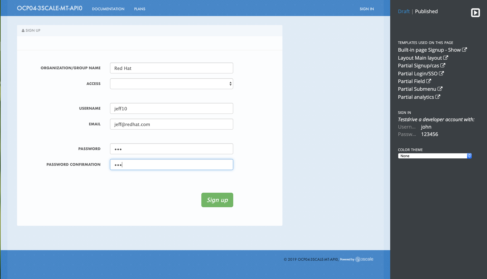
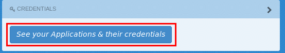
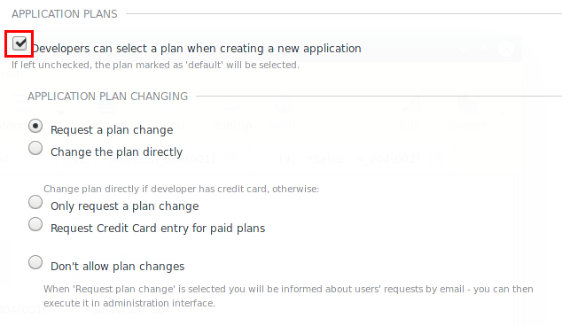
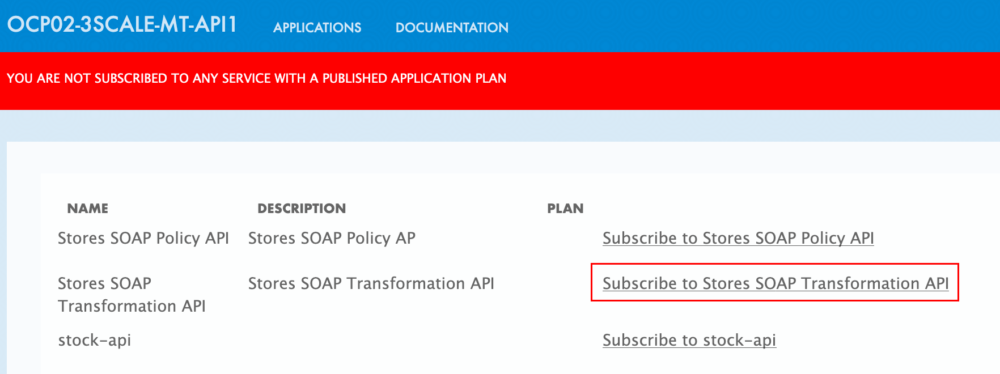
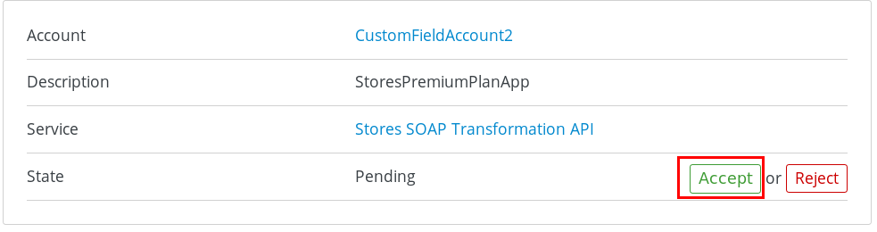
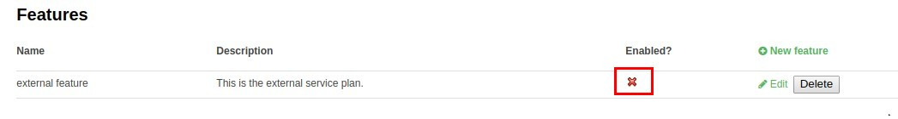
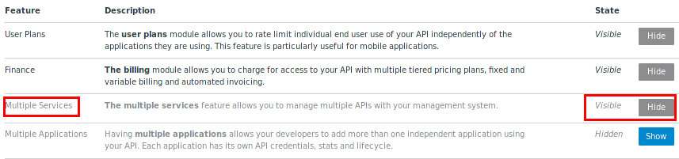

:scrollbar:
:data-uri:
:toc2:
:linkattrs:

== Custom Signup Flows Lab

In this lab, you create custom signup flows to manage various signup approaches for the API consumers of your Red Hat 3scale-managed APIs.
Several signup flows are covered in this lab, including _single application signups_, _multiple application signups_, _custom field_ flow_ and _group membership_ flows.

:numbered:

== Introduction

=== Design Considerations
First, read this excellent article from Kevin Price on link:https://developers.redhat.com/blog/2017/12/18/3scale-developer-portal-signup-flows/["3scale Developer Portal signup flows"].

In this lab, you follow the four examples discussed in the blog article and adapt them to the services and APIs managed here.

The signup flow that you, as an API provider, select and implement in your production environment to onboard API consumers is a function of several considerations, including the following:

* Should any of your API services be made available to non-registered API consumers ?
* Should default _applications_ be created for each service API upon account creation ?
* Should API consumers be prevented from sign-up to more than one application ?
* Should the API provider manually activate all accounts created by API consumers ?
* Are API services available to all API consumers or should they be made available via a group?

=== Issues with Chrome browser

With 3scale 2.4, there are known problems with the Chrome browser when executing this lab.

In particular, the iframes needed to support viewing of the 3scale Developer Portal and 3scale Content Management System (CMS) in different frames or tabs of the same Chrome browser can be problematic.
The following is an example page where the Dev Portal and CMS are being accessed in separate frames of the same tab:

When submitting the form in the example screenshot above, the Chrome browser will often fail with a message as follows:

This problem only affects some versions of Chrome.
Please try upgrading to the latest version of Chrome.
If that still does not help, then please switch to the Firefox browser.

=== _APIs as a Product_ considerations

link:https://issues.jboss.org/browse/THREESCALE-1714[APIs as a Product] is an upcoming new capability that once implemented will greatly affect the on-boarding of API consumers.
Please track this Jira to stay abreast of those changes.

== SMTP Considerations

=== SMTP Provider used by 3scale API Manager
The signup flows utilized in this lab make use of emails to communicate with the API consumer.

Subsequently, the 3scale site admin will have had to configure the 3scale API Manager to authenticate with a remote SMTP provider to deliver those emails.
You can verify this as follows:

-----
$ oc get configmap smtp -o json -n $API_MANAGER_NS | jq .data
-----

These SMTP provider configurations are applicable site wide (as opposed to specific and configureable per 3scale tenant) and are used to send out emails from all tenants in the 3scale API Manager.

=== Multiple email addresses

The various sign-up flow use-cases of this lab will have you play the role of both API provider as well as API consumer of multiple applications.
As an API consumer, you will need a unique email address to register for each application.

Subsequently, for the purpose of this lab, you will need multiple email addresses.

If you are a Red Hat associate, then you can use an smtp email trick implemented by Red Hat's IT department; in particular you can append a string in the form of  _+[a-z1-9]_ after your email name.ie:  if your email address was _shadowman@redhat.com_, you could also use the following aliases:  _shadowman+1@redhat.com_, _shadowman+2@redhat.com_, etc  .  Emails sent to all of these aliases would be routed to your inbox at _shadowman@redhat.com_.

If you are a Red Hat partner, your email provider might not implement the same SMTP trick that Red Hat's IT department has.
In that case, you can use a zero-cost service such as the following:  http://www.yopmail.com/en/email-generator.php

== API Consumer Signup initiated by Administrators
All of the examples of API Consumer signup in this course as well as pre-req courses have involved creation of a _developer account_ by the tenant administrator.
This approach to API consumer onboarding is fine for demo purposes but most likely is not scalable in a real-world production environment.

Also, recall (from a previous lab in the _3scale API Development_ course pre-req) that an API _Account Admin_ can invite multiple additional new API Consumers to that account via the Developer Portal. 

The follow-on sections in this lab focus on API Consumer sign-up flows initiated by the API Consumer.

== Automatic Signup via Account Creation

The existance of a _default_ application plan for an API service will influence the behavior of API consumer sign-up flows.

For example, the out of the box api (whose name happens to be called _API_) that comes pre-provisioned with the creation of a new tenant includes two Application Plans.
One of the Application Plans (called _Basic_ ) is optionally designated as the  _Default Application Plan_ for the _API_ service.

Subsequently, upon creation of a new API Consumer  _account_, a new _application_ (derived from the _Basic_ application plan and the new account) is created.

[blue]#From the perspective of the API Consumer, this behavior could support the most basic type of signup to your Developer Portal#:

. API Consumer navigates to the Developer Portal of your tenant.
. API Consumer creates an account.
.. An _application_ derived from that API Consumer's account and the _default application plan_ of each API service is automatically created.
.. Using the details of this new _application_, the API Consumer can send requests to corresponding backend business services via the API Gateway.

The remainder of the exercises in this lab assume API services that do not define a _default_ application plan.
Navigate to the _Application Plans_ section of each of your APIs to verify that a default application plan is not defined.

Because your API services do not specify a default Application Plan, an _application_ that an API Consumer can get started with will not be created by simply creating a new account.
Instead, the signup flow via the Developer Portal involves requiring the API Consumer to select specific applications plans.

== Save Original Signup Flow as a _Partial_

=== Overview

The out-of-the-box Homepage in the 3scale Content Management System (CMS), which gets rendered to API consumers in the Developer Portal, has a very simple signup flow embedded in it.

In this section of the lab, you extract that embedded signup flow and save it as a _partial_.
You then reference that new partial in your homepage.

Because you are simply moving the original signup flow logic from the Homepage to a referenced partial, you can expect to see no changes to the look and feel of your Developer Portal.

In subsequent sections of this lab, you implement more sophisticated signup flows that are also implemented as partials.
All of your signup flows can easily be swapped in and out of the Developer Portal Homepage simply by changing the reference to the desired partial.
You can then compare and contrast their features and behaviors.

=== Create Partial

. From the Admin Portal, navigate to *Audience -> Developer Portal*. This expands options related to the CMS.
. In the left-hand panel, click *Content* and observe the default look and feel of the CMS homepage.
. In the left-hand panel, click *Visit Portal*.
+
* Make note of the default look and feel of the Developer Portal along with its focus on the _Echo API_.

. In the CMS, navigate to *My -> Root -> Homepage*.
. In the text editor, cut lines 119 through 182 (NOTE: do not delete) and save the change.
. From the *New Page* list at the top right, select *New Partial*:
+
image::images/click_new_partial.png[]

. Enter `original_app_signup_form` as the *System name*.
. Paste the contents you previously cut from the *Homepage* into the text box and click *Create Partial*.
. Return to the *Homepage* text editor and enter the following at line 119:
+
[source,texinfo]
-----
<section class="plan">
    
</section>
-----
+
image::images/reference_original_partial.png[]

. Save the changes.

. Publish both changes by clicking *Drafts* in the left-hand panel, then *Publish All*:
+
image::images/3scale_amp_custom_signup_single_plan_2.png[]

. Click *Visit Portal* again and make sure nothing has changed.
+
****
*Questions*:

* Why is only one API service being displayed in the Developer Portal?
* What is the `system_name` of that API service?
****
ifdef::showscript[]

* 
* api

endif::showscript[]

== Single Application Signup Flow

=== Overview

This is the simplest signup flow that requires the API Consumer to select from application plans.

It allows a subscription to a single service and application plan upon account creation.

This signup flow is actually very similar to the original signup flow you saved as a partial in the previous section of this lab.

The only differences between this signup flow and the original are:

* The original partial is hard-coded to render the details of the sample `Echo` API that comes with a fresh installation of the product.
* The `single-app` signup flow used in this section iterates through the application plans of all of the services from the provider account.
The API consumer is allowed to sign up for one of the many application plans displayed.

You do not need to enable any special features in the Developer Portal to use this flow.

The signup flow is provided in the `~/lab/3scale_development_labs/DevPortal/_single_app_signup_form.html.liquid` partial.

=== Create Single Application Signup Flow

. Open the `~/lab/3scale_development_labs/DevPortal/_single_app_signup_form.html.liquid` file and examine the code for the signup flow:
* Service/Application filter:
+
[source,texinfo]
----
            
      		<h2> {{ service.name }} </h2>
      		

            
----
+
** The above liquid filter iterates through the list of all services for the provider, and then further iterates through all of the application plans.
Thus, this filter allows you to display a list of all services along with the _service plans_.

* Plan features/limits:
+
[source,texinfo]
----
    

        <article class="panel panel-default">
            

                <strong>{{ plan.name }}</strong>
            

            

                

                    
                    

                        <h5>Features</h5>
                        <ul class="features list-unstyled">
                            
                            <li>
                                <i class="fa fa-check"></i> {{ feature.name }}
                            </li>
                            
                        </ul>
                    

                    
                    

                        <h5>Limits</h5>
                        <ul class="limits list-unstyled">
                             
                            <li>
                                <i class="fa fa-signal"></i> {{ limit.metric.name }} &ndash; {{ limit.value }} {{ limit.metric.unit }}s per {{ limit.period }}
                            </li>
                             
                            <li>
                                <i class="fa fa-signal"></i> No limits
                            </li>
                            
                        </ul>
                    

                

            

----
** This code displays the plan name and the features and limits that are set up for the plan.

* Signup link:
+
[source,texinfo]
----
                   <a class="btn btn-cta-secondary pull-right" href="{{ urls.signup }}?{{ plan | to_param }}&{{ service.service_plans.first | to_param }}">Signup to plan {{ plan.name }}</a>

----
** This section shows the link that redirects to the signup form for the chosen plan and service.

. Add this partial to the Developer Portal:
.. From the *New Page* list at the top right, select *New Partial*.
.. Enter `single_app_signup_form` as the *System name*.
.. Copy and paste the contents of the `~/lab/3scale_development_labs/DevPortal/_single_app_signup_form.html.liquid` file into the text editor.
.. Click *Create Partial*.
.. Confirm that the partial shows up in the *Partials* list:
+
image::images/3scale_amp_custom_signup_single_plan.png[]

. Edit the Homepage:
.. Near line 120, replace `original_app_signup_form` with `single_app_signup_form`:
+
[source,texinfo]
....
  <section class="plan">
    
  </section>

....
+
NOTE: The `include` section ensures that the content of the partial is displayed on the Homepage.

. Save the file.
. Publish both of the changes:
+
image::images/3scale_amp_custom_signup_single_plan_2.png[]

=== Test
. Navigate to the *Developer Portal* and make sure you are currently logged out.
. Verify that the Homepage now displays all of the API services and application plans that you created in the previous labs:
+

. Sign up by clicking the signup link for one of the application plans.

* Note that you are only allowed to select the link for one application plan at a time.

. Complete the form with details about a new user, including a valid email address:
+

* Once your signup is successful, expect to see a success message:
+
image::images/3scale_amp_custom_signup_single_plan_5.png[]

. Look for the email at the email address you provided:
+
image::images/3scale_amp_custom_signup_single_plan_6.png[]

. Click the link to activate your account and sign in with the username and password you used in creating the account.
. In the Admin Portal, navigate to *Audience -> Accounts* and verify that the account and user were created:
+
image::images/3scale_amp_custom_signup_single_plan_7.png[]

== Multiple Application Signup Flow

=== Overview
The multiple application signup flow allows users to sign up for multiple services (and their associated application plans) at the same time.
It does so by providing a partial that renders a multiple-selection check-box HTML form in the Developer Portal.

In addition, the *Multiple Applications* feature needs to be enabled in the Developer Portal.

=== Create Multiple Application Signup Flow

. Log in to the Admin Portal and navigate to *Developer Portal*.
. Click *Feature Visibility*.
. Confirm that the *Multiple Services* and *Multiple Applications* features are marked *Visible*:
+

+
[NOTE]
====
The signup flow is provided in the `~/lab/3scale_development_labs/DevPortal/_multiple_app_signup_form.html.liquid` partial.
====

. Open the `~/lab/3scale_development_labs/DevPortal/_multiple_app_signup_form.html.liquid` file and examine the code for the signup.
* Note that the form is very similar to the `_single_app_signup_form.html.liquid` form.
. Observe the following key points:
* The signup form:
+
[source,texinfo]
----
<form action="{{ urls.signup }}" method="get">
----

* The check box input:
+
[source,texinfo]
----
<input type="checkbox" name="plan_ids[]" value="{{ plan.id }}">Signup to {{ plan.name }}</input>
<input type="hidden" name="plan_ids[]" value="{{ service.service_plans.first.id }}"></input>

----

* A "Submit" button that directs to the signup form:
+
[source,texinfo]
----
    <button type="submit" class="btn btn-cta-primary">Signup</a>
----
. Upload the partial to the Developer Portal:
.. Enter `multi_app_signup_form` as the *System name*.
.. Copy and paste the contents of the `~/lab/3scale_development_labs/DevPortal/_multiple_app_signup_form.html.liquid` file into the text editor and click *Create Partial*.
. Make sure that the partial shows up in the menu.
. Edit the *Homepage* and change the `include` section to use `multi_app_signup_form` instead of `single_app_signup_form`.
. Save and publish the changes.

=== Test
. Navigate to the *Developer Portal* and make sure you are currently logged out.
. Confirm that the Homepage now has the multiple signup form, with a check box for each application plan:
+

. Attempt to sign up for two different applications, such as *StoresTransPremiumPlan* and *StockODataPremiumPlan*.
. Complete the form with details about a new user, including a valid email address.
. Click the link in the confirmation email and log in as the new user.
* Note that you can see all of the registered applications and the keys that were created for those applications:
+

. In the Admin Portal, navigate to *Audience -> Accounts* and verify that the account and user were created:
+
image::images/3scale_amp_custom_signup_multi_plan_5.png[]

. Optional: Now that your API consumer has created an account (and has been assigned an  _application_ associated with the _application plan_ they selected), modify your partial to allow the authenticated API consumer to select additional _application plans_ to subscribe to.

== Custom Field Flow

=== Overview

In this section of the lab, you will make use of the following 3scale capabilities:

. *Custom _fields_ on API consumer accounts*
+
This flow uses a custom field on the API consumer account to control which services those API consumers can see and subscribe to.
+
A typical use case is one in which there are multiple application plans, each with different access--for example, one plan for internal developers and another for external developers.

. *API consumer account approval*
+
The custom field that you define on an API consumer account can be combined with signup flows that make use of the _Account Approval_ feature that an administrator uses to view and approve a user for a particular service.

. *Custom _features_ on application plans*
+
Custom _features_ on application plans correspond to the custom _fields_ on API consumer accounts and assist in the filtering of application plans visible in the Developer Portal during sign-up.

. *Allow consumers to select an application plan after account sign-up*

==== APIs
In this use case, you utilize two of the `Stores`-related APIs that you created in previous labs.

* *Stores SOAP Policy API*: Manages SOAP services and introduces a custom SOAP policy to track metrics for each SOAP operation.
** In this scenario, you make this _internal_ and available only to API consumers who are signed up as internal users.

* *Stores SOAP Transformation API*: Uses Red Hat Fuse as a REST-to-SOAP XML mediation layer.
** In this scenario, you make this endpoint available to API consumers who are signed up as _public_ users.
** You further restrict public users by requiring account approval by an administrator before they can access the `Stores` API.

=== Set Up Custom Field on Accounts

You start by defining the custom field on the API consumer's Accounts object.

. Open the Admin Portal and navigate to *Audience -> Accounts -> Fields Definitions*.
. Click *Create* to the right of *Account*:
+
image::images/account_field_create.png[]

. Enter the following values:
* *Name*: `access`
* *Label*: `access`
* Leave the *Required*, *Hidden*, and *Read only* boxes unchecked.
* *Choices*: `internal, public`
+

+
[NOTE]
====
You can make the field a *Required* field so that any user signup flow contains this field.
Another use case is to make it a *Hidden* field with simple JavaScript code providing this value--for example, based on the user's email address.
You can also make this field a *Read Only* field that only an API provider tenant administrator can change.

In this scenario, you leave all of these options unchecked so that upon signup, the user can see this field and optionally decide whether to gain access to the internal or public API.
====
. Click *Create* and verify that the field is successfully added to the Account object:
+
image::images/3scale_amp_custom_signup_field_plan_3.png[]

=== Enable Account Approval
It is possible to require that an API provider approves and activates all accounts initiated by API consumers.
In this section, you enable this feature.

. In the Admin Portal, as an API provider, navigate to *Audience -> Accounts -> Usage Rules -> Signup*.
. Check the *Account approval required* box.
. Click *Update Settings*.

This feature is used in both this custom signup flow and the group membership signup flow introduced later in this lab.

=== Modify APIs and Application Plans

In this section, you define a custom feature for two of your API services: `Stores SOAP Policy API` and `Stores SOAP Transformation API`.

The values (`internal` and `public`) of these features correspond to the values of the field you previously defined for all API consumer accounts.

==== Modify Stores SOAP Policy API

. Navigate to *Settings* for the `Stores SOAP Policy API` and check the *Developers can select a plan when creating a new application* box:
+

. Click *Update Service*.

. Navigate to the `StoresSOAPBasicPlan` application plan of the `Stores SOAP Policy API`.
. Create a new *Feature* with the following values:
* *Name*: `internal`
* *System name*: `internal`
* *Description*: `This Plan is intended for internal users.`
+

. Click *Save*.

. Click the *x* in the *Enabled?* column to enable the feature.

==== Modify Stores SOAP Transformation API

. In the `Settings` section of the `Stores SOAP Transformation API`, enable the *Developers can select a plan when creating a new application* option.
. Navigate to the `StoresTransPremiumPlan` of the `Stores SOAP Transformation API`.
. Check the *Application requires approval?* box.
. Create a new *Feature* for this plan with the following values:
* *Name*: `public`
* *System name*: `public`
* *Description*: `This Plan is intended for public users.`
. Save the new feature, then enable it.

=== Make Developer Portal Changes

In this section, you specify two partials in the Homepage.

The first new partial (called: _unauthenticated_noplan_signup_form_) renders in the Developer Portal for unauthenticated users.
The second new partial (called: _custom_field_signup_form_)  renders in the Developer Portal only after the API consumer has registered a new account and authenticated in.

. Add the `unauthenticated_noplan_signup_form` partial using the contents of the `~/lab/3scale_development_labs/DevPortal/_unauthenticated_noplan_signup_form.html.liquid` file.
.. In the *Homepage*, modify the `include` statement near line 123:
+
[source,texinfo]
----

----

* This partial is rendered for unauthenticated users.
Note that it simply provides a link to the registration page.

. Add the `custom_field_signup_form` partial using the contents of the `~/lab/3scale_development_labs/DevPortal/_custom_field_plans.html.liquid` file.
.. In the *Homepage*, add the following after line 87 and before the `` line:
+
[source,texinfo]
----

----

* This partial is rendered for authenticated API consumers.
Note that it contains logic to iterate through the list of services and application plans and then offers the API consumer the ability to register for only those plans available per the custom account field.

. Save and publish all of the changes.

=== Test Custom Field Flow for Public Access

. Navigate to the *Developer Portal* and make sure you are currently logged out.
. Click the link provided by `unauthenticated_noplan_signup_form`:
+

. Complete the form with details about a new user, including a valid email address.
. For *ACCESS*, select `public`.
. Click *Sign up*:
+
image::images/3scale_amp_custom_signup_field_plan_7.png[]

. In the Admin Portal, navigate to *Audience -> Accounts* and verify that the account and user were created:
+
image::images/3scale_amp_custom_signup_field_plan_8.png[]
+
NOTE: Even if no application is selected during signup, the default plans for each service are created for each account.

. Activate the user by clicking the activation link in the email.
+
Account activation is required because you (as an admin of your tenant) previously checked the box `Account approval required`.

. Log in to the Developer Portal as the new user and note that the Homepage now displays the *PUBLIC* plan for the user to subscribe to:
+

.. This plan is viewable to the authenticated API Consumer because the API Provider previously enabled the option: `Developers can select a plan when creating a new application` on the API.

.. Why are *INTERNAL* plans that may exist not rendered as an option to the API consumer?
+
HINT: Study the _liquid_ code embedded in the first 15 lines of the _partial_ executed for authenticated users: _custom_field_signup_form_.

. Click *Signup to plan StoresTransPremiumPlan*
. Your browser will redirect to a page warning you that you currently have not yet selected an application plan:
+

+
Click the _Subscribe to Stores SOAP Transformation API_ link.

. In the new page, provide a name and description for the new plan, and click *Create Application*.

* Note that the *Pending* status notification indicates that the application is awaiting approval:
+

. In the Admin Portal, as the API provider, navigate to the newly created application and note its current *State* of `Pending`.
. Click *Accept* to accept the application:
+

=== Test Custom Field Flow for Internal Access

For this test, repeat the steps from the previous section to create a user with `internal` access, and make sure that you can subscribe the user to the `StoresSOAPBasicPlan` plan.

== Group Membership Signup Flow

=== Overview

Group membership signup flow is especially useful when you want to control access to the services as well as the application plans.
If you want to specify _sections_ of HTML content that API consumers can access only when they have the correct permissions, this is the flow to use.

The use case for this exercise is similar to the previous exercise on custom field signup.
Instead of relying on application plans for `internal` and `public` user signup, you rely on _service plan_ features to restrict signups to API services.

Specifically in this use case, APIs are designated--via a feature of their default service plans--as either `external` or `private`.
In this manner, API consumers who are assigned to an `external` group by the API provider can only sign up for application plans from an `external` API.
Similarly, API consumers who are assigned to a `private` group by the API provider can only sign up for application plans from a `private` API.

You need a mechanism to allow an API provider to specify the type (`external` or `private`) of newly registered API consumer accounts.
You use *Groups* and *Sections* for this.

=== Enable Service Plans
To set up this group membership signup flow, you need to enable _service plans_.

==== What are _service plans_ ?

Service Plans establish pricing and features on the service API level (as opposed to the application plan level).

They allow an API provider with the ability to define grades of service for each of the APIs available through the developer portal.

==== Procedure

. As an API provider, log in to the Admin Portal and navigate to *Audience -> Accounts -> Settings -> Usage Rules*.
. Check the *Service Plans* box and click *Update Settings*:
+

* Enabling service plans makes the following features visible in the Admin Portal:

** *<any API> -> Overview -> Published Service Plans*
+

** *Audience -> Accounts -> Subscriptions*:
+
image::images/list_ss.png[]

=== Modify Default Service Plan of Stores SOAP Policy API

. As an API provider, navigate to the *Subscriptions -> Service Plans* section of the `Stores SOAP Policy API`.
. Make sure that the *Default Plan* text box is empty:
+
image::images/3scale_amp_group_member_signup_plan_2.png[]

. Click the *Default* service plan.
. Click *New Feature* and enter the following values:
* *Name*: `external feature`
* *System name*: `serviceplan/external`
* *Description*: `This is the external service plan.`
. Click *Save* and then click the *x* in the *Enabled?* column to enable the feature:
+

=== Modify Default Service Plan of Stores SOAP Transformation API

. As you did in the previous section, create a new feature for the *Default* service plan of the `Stores SOAP Transformation API` with the following details:
* *Name*: `private feature`
* *System name*: `serviceplan/private`
* *Description*: `This is the private service plan.`

. As you did with the previous service, make sure that a *Default* service plan text box for this API is empty.

=== Enable Features in Developer Portal

By default, some features of the Developer Portal are configured as `hidden`.
Specifically for this group membership signup flow, you need to enable two important features of the Developer Portal.

. Navigate to *Audience -> Developer Portal -> Feature Visibility*.
. For *Multiple Services*, click *Show*.
+
It's status should change to: _visible_.
+

=== Create New Sections in Developer Portal

HTML _sections_ are groupings of content and appear as entries in an outline of an HTML page.

Beyond this basic HTML functionality, 3scale API Management further enhances the use of HTML sections.
Specifically, 3scale API Management also maintains a listing of HTML sections that an API consumer of an account is affiliated with.

It is this latter capability of sections that facilitates the group membership signup flow.

. Navigate to *Audience -> Developer Portal -> Content*.
. Select *New Section* from the *New Page* list.
. Enter the following values:
* *Title*: `external`
* *Public*: Uncheck the box
* *Parent*: `.Root`
* *Partial path*: `/external`
+

. Click *Create Section*.
. Create another *New Section* for `private` with the following values:
* *Title*: `private`
* *Public*: Uncheck the box
* *Parent*: `.Root`
* *Partial path*: `/private`

=== Create New Groups in Developer Portal

Now that you have defined HTML sections that align with your use case, you need to make use of _groups_ to create a grouping of these sections.

Later in the lab, you see how an API provider can associate groups to API consumer accounts.

. From the left-hand panel of the CMS, click *Groups*.
. Create a new group called `External` and assign it the `external` section:
+

+
NOTE: You may have to repeat this step due to link:https://issues.jboss.org/browse/THREESCALE-836[THREESCALE-836].

. Create another new group called `Private` and assign it the `private` section.
. Confirm that both groups are created and the correct sections are assigned:
+

=== Add Group Membership Flow to Developer Portal

. Study the contents of the `~/lab/3scale_development_labs/DevPortal/_group_membership_plans.html.liquid` file and make sure you understand the liquid logic that is used to present the user with the correct signup form based on their group membership.

. Via the CMS, add a `group_member_signup_form` partial to the Developer Portal *Homepage*.
. Copy and paste the contents from the `~/lab/3scale_development_labs/DevPortal/_group_membership_plans.html.liquid` file to your new partial.

. Navigate to the CMS and make the following changes to the *Homepage*:
.. At about line 88 (above the  liquid tag), remove the reference to the following line you created previously:
+
[source,texinfo]
----
 
----

..  Replace that line with the following:
+
[source,texinfo]
----
  

      

        

      

        

    

  
----
+
NOTE: This liquid code ensures that if the user has a private section--that is, they are part of the group--then the section is presented to the user. Otherwise, the custom field signup form section is presented.

. In your *HomePage*, you should still have an include statement below the `` tag that references the `unauthenticated_noplan_signup_form`
+

. Publish all of the changes in the Developer Portal.

=== Test Group Membership Flow for External Access

To subscribe to any API, an API consumer must sign up to create an account first.
Therefore, the services and plans are only visible to API consumers once they have an account.

The API provider assigns the appropriate group membership once the account has been created.

==== Register New User
. Navigate to the *Developer Portal* and make sure that you are currently logged out.
. Click the link provided by your `unauthenticated_noplan_signup_form`.
. Complete the form with details about a new user, including a valid email address.
. Leave the *ACCESS* parameter blank.
. Click *Sign up*.

==== Activate Account and Assign Group Membership
As the API provider, you need to activate the new account and assign group membership.

. In the Admin Portal, navigate to *Audience -> Accounts* and verify that the account and user were created:
+
image::images/3scale_amp_group_member_signup_plan_11.png[]

* Note that the account does not have any service subscriptions or applications associated with it.
The reason for this is that you previously set the value of the *Default Service Plan* to blank.

. From the *Accounts* page, click *Activate* to activate the account:
+
image::images/3scale_amp_group_member_signup_plan_12.png[]

. In the account's *Account Summary* page, click *Group Memberships*:
+
image::images/3scale_amp_group_member_signup_plan_13.png[]

. Assign the *External* group to the account and click *Save*:
+
image::images/3scale_amp_group_member_signup_plan_14.png[]
+
NOTE: This step associates a list of sections to the API consumers of this account via the group of sections you previously created.
This becomes important in the `group_membership_plans` partial where the sections associated with a user are compared with the features of the API via the API's service plans.

==== Subscribe to Service
As the API consumer, you need to subscribe to the service.

. In a new browser window, log in to the *Developer Portal* as the new user:
+

. Click *Subscribe to the Stores SOAP Policy API service*.
* Note that the *Services* page shows that the user subscribed to the *Default* service for the `Stores SOAP Policy API`:
+
image::images/3scale_amp_group_member_signup_plan_16.png[]
+
NOTE: You can also edit the *Services - Index* page to show only the subscribed services or remove the link to the service subscriptions for the other services, so that the user can see only the services they are already subscribed to. This is an optional exercise.

. As the API provider, verify that the new account is now associated with one service subscription:
+
image::images/ss.png[]

==== Select and Approve Application

. In the Developer Portal, as the API consumer, click *Applications*.
. Click *Create New Application*.
. Complete the form and click *Create Application*

. As the API provider, navigate to the account in the Admin Portal and click the application created for `Stores SOAP Policy API`.
. Note the application's *State*, and click *Accept* to accept the application:
+

=== Test Group Membership Flow for Private Access

Repeat the steps from the previous section to create a user with `private` group membership, and make sure that you can subscribe the user to the `Stores SOAP Transformation API service`.

.Reference
* link:https://developers.redhat.com/blog/2017/12/18/3scale-developer-portal-signup-flows/[https://developers.redhat.com/blog/2017/12/18/3scale-developer-portal-signup-flows/]
