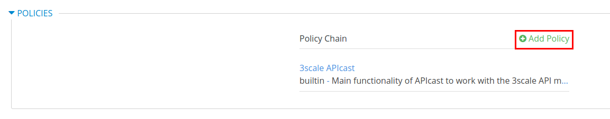
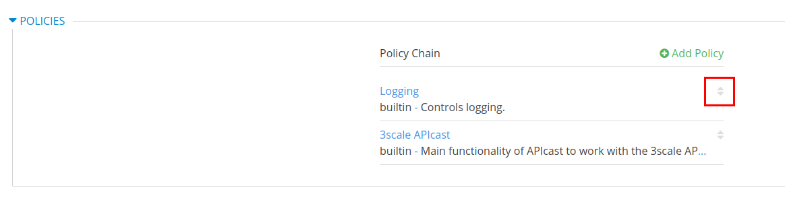
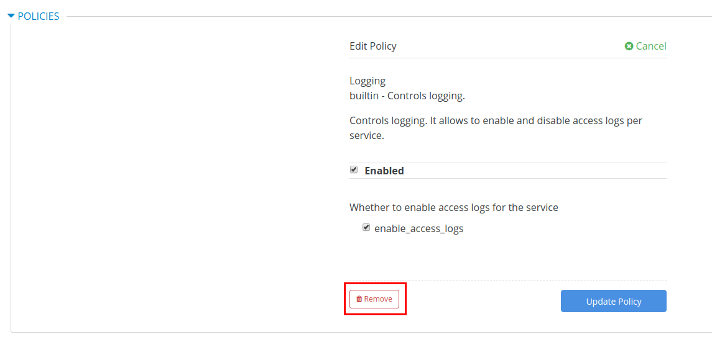
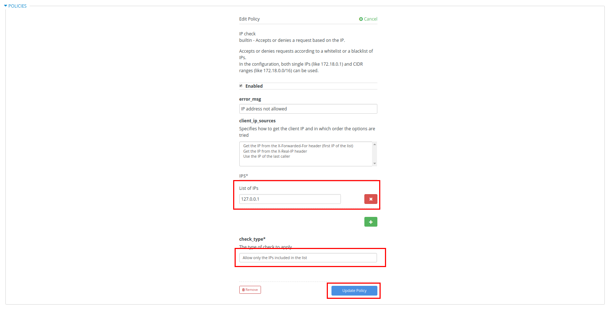

:scrollbar:
:data-uri:
:toc2:
:linkattrs:

== Apicast Customization Lab

In this lab you learn about APIcast gateway customizations. You study two popular standard plugins available in AMP and learn about using these in a policy chain to manage the API gateway behaviour.

.Goals
* Create custom policy in Apicast gateway for Logging
* Create custom policy in Apicast gateway for IP Check
* Create custom configuration in NGINX gateway for echoing request headers

:numbered:

== Policy Chain for Logging

In this section, you set up a policy to provide detailed access logs in the Apicast gateway for each request. This is a standard policy plugin available in AMP and can be configured directly in the service configuration.

=== Configurate the Logging Policy

. In 3scale management portal, navigate to the *SOAP Stores Transformation API* integration.
. Click on *configuration*.
. Scroll down to *Policies* section and click on *Add Policy*.
+

. Select the *Logging* policy.
. Click on the positioning arrows on right to move the Logging policy before the *3scale Apicast* policy in the policy chain.
+

. Click on the *Logging* policy to expand.
. Ensure the policy is *Enabled*, and click on checkbox to select *enable_access_logs*.
+
image::images/3scale_custom_policy_logging_details.png[]

. Click on *Update Policy*.
. Scroll down and click on *Update and test in Staging Environment*.
. Now redeploy the stage-apicast pod in OpenShift by simply deleting the existing one. Kubernetes will make sure a new one is started.
. Wait for a couple of minutes for the deployment to complete, and the pod to be in `Running` state.

=== Test the Logging Policy

. Send a *curl* request to the staging URL:
+
----
$ export STORES_TRANS_API_KEY=<api key to your Stores App>

$ curl -k "https://`oc get route stores-soap-transformation-staging-route -o template --template {{.spec.host}} -n $GW_PROJECT`/allstores?user_key=$STORES_TRANS_API_KEY"

{"store":[{"storeID":1,"storeName":"Downtown\n  Store","storeLat":-34.6052704,"storeLong":-58.3791766},{"storeID":2,"storeName":"EastSide\n  Store","storeLat":-34.5975668,"storeLong":-58.3710199}]}
----

. Now check the logs of the *stage-apicast* pod and notice that the log has details of the request:
+
----
$ oc logs -f po/<stage-apicast-pod>

----

. You should see multiple logs related to the request.
+
----
2019/01/11 14:24:37 [info] 21#21: *61 [lua] configuration_loader.lua:213: rewrite(): lazy loading configuration for: stores-trans-staging-apicast-user1.apps.8d2d.openshift.opentlc.com, client: 10.1.2.1, server: _, request: "GET /allstores?user_key=aa35a0672913effeb77df946404e3830 HTTP/1.1", host: "stores-trans-staging-apicast-user1.apps.8d2d.openshift.opentlc.com"
2019/01/11 14:24:37 [info] 21#21: *61 [lua] remote_v2.lua:181: call(): could not get configuration for service 3: invalid status: 404 (Not Found), client: 10.1.2.1, server: _, request: "GET /allstores?user_key=aa35a0672913effeb77df946404e3830 HTTP/1.1", host: "stores-trans-staging-apicast-user1.apps.8d2d.openshift.opentlc.com"
2019/01/11 14:24:37 [info] 21#21: *61 [lua] configuration_store.lua:124: store(): added service 6 configuration with hosts: user1-apicast-prod.apps.8d2d.openshift.opentlc.com, user1-apicast-stage.apps.8d2d.openshift.opentlc.com ttl: 300, client: 10.1.2.1, server: _, request: "GET /allstores?user_key=aa35a0672913effeb77df946404e3830 HTTP/1.1", host: "stores-trans-staging-apicast-user1.apps.8d2d.openshift.opentlc.com"
2019/01/11 14:24:37 [info] 21#21: *61 [lua] configuration_store.lua:124: store(): added service 7 configuration with hosts: user1-swarm-prod-apicast.apps.8d2d.openshift.opentlc.com, user1-swarm-stage-apicast.apps.8d2d.openshift.opentlc.com ttl: 300, client: 10.1.2.1, server: _, request: "GET /allstores?user_key=aa35a0672913effeb77df946404e3830 HTTP/1.1", host: "stores-trans-staging-apicast-user1.apps.8d2d.openshift.opentlc.com"
2019/01/11 14:24:37 [info] 21#21: *61 [lua] configuration_store.lua:124: store(): added service 8 configuration with hosts: stores-soap-prod-user1.apps.8d2d.openshift.opentlc.com, stores-soap-staging-user1.apps.8d2d.openshift.opentlc.com ttl: 300, client: 10.1.2.1, server: _, request: "GET /allstores?user_key=aa35a0672913effeb77df946404e3830 HTTP/1.1", host: "stores-trans-staging-apicast-user1.apps.8d2d.openshift.opentlc.com"
2019/01/11 14:24:37 [info] 21#21: *61 [lua] configuration_store.lua:124: store(): added service 9 configuration with hosts: stores-trans-prod-apicast-user1.apps.8d2d.openshift.opentlc.com, stores-trans-staging-apicast-user1.apps.8d2d.openshift.opentlc.com ttl: 300, client: 10.1.2.1, server: _, request: "GET /allstores?user_key=aa35a0672913effeb77df946404e3830 HTTP/1.1", host: "stores-trans-staging-apicast-user1.apps.8d2d.openshift.opentlc.com"
2019/01/11 14:24:37 [info] 21#21: *61 [lua] proxy.lua:81: output_debug_headers(): usage: usage%5Bhits%5D=1 credentials: user_key=aa35a0672913effeb77df946404e3830, client: 10.1.2.1, server: _, request: "GET /allstores?user_key=aa35a0672913effeb77df946404e3830 HTTP/1.1", host: "stores-trans-staging-apicast-user1.apps.8d2d.openshift.opentlc.com"
2019/01/11 14:24:37 [info] 21#21: *61 [lua] proxy.lua:148: apicast cache miss key: 9:aa35a0672913effeb77df946404e3830:usage%5Bhits%5D=1 value: nil, client: 10.1.2.1, server: _, request: "GET /allstores?user_key=aa35a0672913effeb77df946404e3830 HTTP/1.1", host: "stores-trans-staging-apicast-user1.apps.8d2d.openshift.opentlc.com"
2019/01/11 14:24:37 [info] 21#21: *61 [lua] balancer.lua:108: set_current_peer(): balancer set peer 172.30.241.10:3000 ok: true err: nil while connecting to upstream, client: 10.1.2.1, server: _, request: "GET /allstores?user_key=aa35a0672913effeb77df946404e3830 HTTP/1.1", subrequest: "/transactions/authrep.xml", host: "stores-trans-staging-apicast-user1.apps.8d2d.openshift.opentlc.com"
2019/01/11 14:24:37 [info] 21#21: *61 [lua] backend_client.lua:139: call_backend_transaction(): backend client uri: http://backend-listener.3scale-mt-api0:3000/transactions/authrep.xml?service_token=bec56f680e8deefbad84535ef4f7d1d72e4688f75626dda9b4813d59bc6a3b84&service_id=9&usage%5Bhits%5D=1&user_key=aa35a0672913effeb77df946404e3830 ok: true status: 200 body:  error: nil while sending to client, client: 10.1.2.1, server: _, request: "GET /allstores?user_key=aa35a0672913effeb77df946404e3830 HTTP/1.1", host: "stores-trans-staging-apicast-user1.apps.8d2d.openshift.opentlc.com"
2019/01/11 14:24:37 [info] 21#21: *61 [lua] cache_handler.lua:43: cache_handler(): apicast cache write key: 9:aa35a0672913effeb77df946404e3830:usage%5Bhits%5D=1, ttl: nil while sending to client, client: 10.1.2.1, server: _, request: "GET /allstores?user_key=aa35a0672913effeb77df946404e3830 HTTP/1.1", host: "stores-trans-staging-apicast-user1.apps.8d2d.openshift.opentlc.com"
2019/01/11 14:24:37 [info] 21#21: *61 [lua] balancer.lua:108: set_current_peer(): balancer set peer 3.121.61.119:80 ok: true err: nil while connecting to upstream, client: 10.1.2.1, server: _, request: "GET /allstores?user_key=aa35a0672913effeb77df946404e3830 HTTP/1.1", host: "stores-fis-user1.apps.8d2d.openshift.opentlc.com"
2019/01/11 14:24:37 [info] 21#21: *61 [lua] proxy.lua:331: [async] skipping after action, no cached key while sending to client, client: 10.1.2.1, server: _, request: "GET /allstores?user_key=aa35a0672913effeb77df946404e3830 HTTP/1.1", upstream: "http://3.121.61.119:80/allstores?user_key=aa35a0672913effeb77df946404e3830", host: "stores-fis-user1.apps.8d2d.openshift.opentlc.com"
[11/Jan/2019:14:24:37 +0000] stores-trans-staging-apicast-user1.apps.8d2d.openshift.opentlc.com:8080 10.1.2.1:56036 "GET /allstores?user_key=aa35a0672913effeb77df946404e3830 HTTP/1.1" 200 208 (0.214) 0
2019/01/11 14:24:37 [info] 21#21: *61 client 10.1.2.1 closed keepalive connection (104: Connection reset by peer)

----

. Now remove the policy *Logging*, update the staging environment and redeploy the apicast-stage pod.
+

. Send the request again and observe that the logs are now recording lesser information regarding the request.
+
----
2019/01/11 14:15:09 [info] 22#22: *63 [lua] proxy.lua:81: output_debug_headers(): usage: usage%5Bhits%5D=1 credentials: user_key=aa35a0672913effeb77df946404e3830, client: 10.1.2.1, server: _, request: "GET /allstores?user_key=aa35a0672913effeb77df946404e3830 HTTP/1.1", host: "stores-trans-staging-apicast-user1.apps.8d2d.openshift.opentlc.com"
2019/01/11 14:15:09 [info] 22#22: *63 [lua] proxy.lua:148: apicast cache miss key: 9:aa35a0672913effeb77df946404e3830:usage%5Bhits%5D=1 value: nil, client: 10.1.2.1, server: _, request: "GET /allstores?user_key=aa35a0672913effeb77df946404e3830 HTTP/1.1", host: "stores-trans-staging-apicast-user1.apps.8d2d.openshift.opentlc.com"
2019/01/11 14:15:09 [info] 22#22: *63 [lua] balancer.lua:108: set_current_peer(): balancer set peer 172.30.241.10:3000 ok: true err: nil while connecting to upstream, client: 10.1.2.1, server: _, request: "GET /allstores?user_key=aa35a0672913effeb77df946404e3830 HTTP/1.1", subrequest: "/transactions/authrep.xml", host: "stores-trans-staging-apicast-user1.apps.8d2d.openshift.opentlc.com"
2019/01/11 14:15:09 [info] 22#22: *63 [lua] backend_client.lua:139: call_backend_transaction(): backend client uri: http://backend-listener.3scale-mt-api0:3000/transactions/authrep.xml?service_token=bec56f680e8deefbad84535ef4f7d1d72e4688f75626dda9b4813d59bc6a3b84&service_id=9&usage%5Bhits%5D=1&user_key=aa35a0672913effeb77df946404e3830 ok: true status: 200 body:  error: nil while sending to client, client: 10.1.2.1, server: _, request: "GET /allstores?user_key=aa35a0672913effeb77df946404e3830 HTTP/1.1", host: "stores-trans-staging-apicast-user1.apps.8d2d.openshift.opentlc.com"
2019/01/11 14:15:09 [info] 22#22: *63 [lua] cache_handler.lua:43: cache_handler(): apicast cache write key: 9:aa35a0672913effeb77df946404e3830:usage%5Bhits%5D=1, ttl: nil while sending to client, client: 10.1.2.1, server: _, request: "GET /allstores?user_key=aa35a0672913effeb77df946404e3830 HTTP/1.1", host: "stores-trans-staging-apicast-user1.apps.8d2d.openshift.opentlc.com"
2019/01/11 14:15:09 [info] 22#22: *63 [lua] balancer.lua:108: set_current_peer(): balancer set peer 3.121.61.119:80 ok: true err: nil while connecting to upstream, client: 10.1.2.1, server: _, request: "GET /allstores?user_key=aa35a0672913effeb77df946404e3830 HTTP/1.1", host: "stores-fis-user1.apps.8d2d.openshift.opentlc.com"
2019/01/11 14:15:09 [info] 22#22: *63 [lua] proxy.lua:331: [async] skipping after action, no cached key while sending to client, client: 10.1.2.1, server: _, request: "GET /allstores?user_key=aa35a0672913effeb77df946404e3830 HTTP/1.1", upstream: "http://3.121.61.119:80/allstores?user_key=aa35a0672913effeb77df946404e3830", host: "stores-fis-user1.apps.8d2d.openshift.opentlc.com"
[11/Jan/2019:14:15:09 +0000] stores-trans-staging-apicast-user1.apps.8d2d.openshift.opentlc.com:8080 10.1.2.1:34246 "GET /allstores?user_key=aa35a0672913effeb77df946404e3830 HTTP/1.1" 200 208 (0.050) 0
2019/01/11 14:15:09 [info] 22#22: *63 client 10.1.2.1 closed keepalive connection (104: Connection reset by peer)
----

== Policy Chain for `IP Check`

In this section, you set up a policy to accept or deny a request based on the request IP. This is a standard policy plugin available in AMP and can be configured directly in the service configuration.

=== Configurate the Logging Policy

. In 3scale management portal, navigate to the *SOAP Stores Transformation API* integration.
. Click on *configuration*.
. Scroll down to *Policies* section and click on *Add Policy*.
+

. Select *IP Check* policy.
. As in previous section, move the *IP Check* policy ahead of the *3scale APIcast* policy.
. Click on *IP Check* to expand the policy.
. Add a new IP in the list *127.0.0.1*.
. *check_type* should be *Allow only the IPs included in the list*.	
+

. Click on *Update Policy*.
. Scroll down and click on *Update and test in Staging Environment*.
. Now redeploy the stage-apicast pod in OpenShift by simply deleting the existing one. Kubernetes will make sure a new one is started.
. Wait for a couple of minutes for the deployment to complete, and the pod to be in `Running` state.

=== Test the Logging Policy

. Send a *curl* request to the staging URL:
+
----
$ export STORES_TRANS_API_KEY=<api key to your Stores App>

$ curl -k "https://`oc get route stores-soap-transformation-staging-route -o template --template {{.spec.host}} -n $GW_PROJECT`/allstores?user_key=$STORES_TRANS_API_KEY"

----

. The response should be as follows:
+
----
IP address not allowed
----

. Now modify the *IP Check* policy to use the public IP address of your laptop from which you are running the curl request.
. Update the staging environment and redeploy the apicast-stage pod.
. Now you should notice that the response is received:
+
----
$ curl -k "https://`oc get route stores-soap-transformation-staging-route -o template --template {{.spec.host}} -n $GW_PROJECT`/allstores?user_key=$STORES_TRANS_API_KEY"
{"store":[{"storeID":1,"storeName":"Downtown\n  Store","storeLat":-34.6052704,"storeLong":-58.3791766},{"storeID":2,"storeName":"EastSide\n  Store","storeLat":-34.5975668,"storeLong":-58.3710199}]}
----

. Now change the *IP Check* policy to *Block the IPs included in the list* for your public IP.
. Update the staging environment and redeploy the apicast-stage pod.
. Test the request again and notice that you receive the following response:
+
----
$ curl -k "https://`oc get route stores-soap-transformation-staging-route -o template --template {{.spec.host}} -n $GW_PROJECT`/allstores?user_key=$STORES_TRANS_API_KEY"
IP address not allowed

----

. After completion of this lab, remove the *IP Check* policy so that it does not impact the rest of the labs.

== Custom Configuration for `Echo Headers`

You might need to inject a custom NGNIX configuration into the gateway--for example, to add another server block to handle some routing. 

This configuration does not override the existing configuration. 

Similar to the custom module, a custom configuration can be used to inherit the standard configuration and extend it.

In this section you create a custom configuration to provide more a verbose response to client by echoing all the request headers in the response, along with the API response.

The configuration is link:https://raw.githubusercontent.com/3scale/apicast/3.1-stable/examples/custom-config/echo.conf[here^].

. Examine the code for the `log` function:
+
[source,text]
-----
server {
  listen 8080;
  server_name echo;

  location / {
    echo $echo_client_request_headers;
  }

}
-----

==== Deploy Custom Configuration on OpenShift

. Copy the `echo.conf` file locally:
+
[source,text]
-----
$ curl -o echo.conf https://raw.githubusercontent.com/3scale/apicast/3.1-stable/examples/custom-config/echo.conf
-----

. Verify that you are logged in to OpenShift with your login credentials from the terminal.
. Verify that you are using the `3scale AMP` project:
+
[source,text]
-----
$ oc project $OCP_PROJECT_PREFIX-3scale-amp
-----

. Create a configuration map in the OpenShift project, making sure to provide the correct path to the `echo.conf` file:
+
[source,text]
-----
$ oc create configmap echo-conf --from-file=./echo.conf
-----

. Create a volume for the container, and mount it to the appropriate path:
+
[source,text]
-----
$ oc set volume dc/apicast-staging --add --name=echo-conf --mount-path /opt/app-root/app/sites.d/echo.conf --source='{"configMap":{"name":"echo-conf","items":[{"key":"echo.conf","path":"echo.conf"}]}}'
-----

. The `oc volume` command does not support adding subpaths, so you need to apply a patch:
+
[source,text]
-----
$ oc patch dc/apicast-staging --type=json -p '[{"op": "add", "path": "/spec/template/spec/containers/0/volumeMounts/1/subPath", "value":"echo.conf"}]'
-----
* The `apicast-staging` pod redeploys automatically.

. Wait for the pod to be in a running state.

=== Test Custom Configuration

. Open a terminal and connect via RSH to the `apicast-staging` pod:
+
[source,text]
-----
$ oc rsh <your apicast pod>
-----

* Substitute the name of your `apicast-staging` pod.

. Send a request to port 8080 of `localhost`:
+
[source,text]
-----
sh-4.2$ curl localhost:8080 -H 'Host: echo' -X 'POST'
-----

* Expect a response similar to the following:
+
[source,text]
-----
POST / HTTP/1.1
Host: echo
User-Agent: curl/7.49.1
Accept: */*
-----

-----
