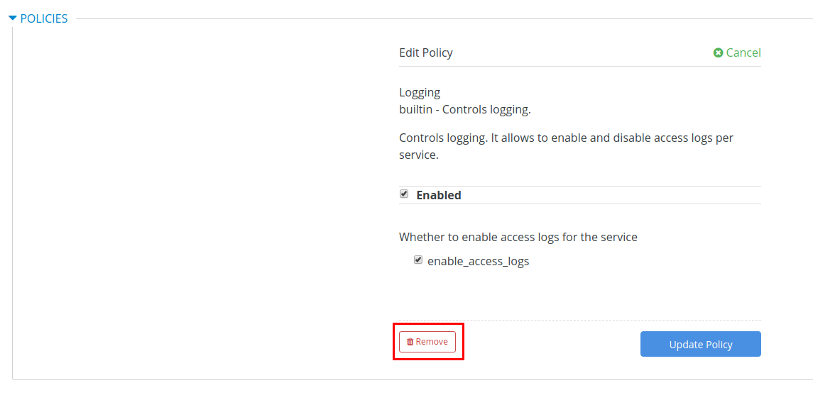
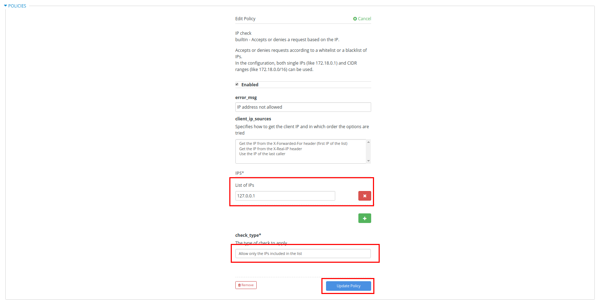

:scrollbar:
:noaudio:
:toc2:
:linkattrs:
:data-uri:

== API Gateway Policies Lab

In this lab you learn about API gateway policies. 
You study two popular standard policies available and learn about using them in a policy chain to manage the API gateway's behavior.

.Goals
* Create a custom `Logging` policy in an APIcast gateway
* Create a custom `IP check` policy in an APIcast gateway

.Reference
* link:https://access.redhat.com/documentation/en-us/red_hat_3scale_api_management/2.4/html-single/deployment_options/#standard-policies[API Gateway Standard Policies]

:numbered:

== Policy Chain for `Logging`

In this section, you set up a policy to provide detailed access logs in the APIcast gateway for each request.
This is a standard policy plug-in available in 3scale API Management that can be configured directly in the service configuration.

=== Configure `Logging` Policy

. In the Admin Portal, navigate to the `SOAP Stores Transformation API` integration.
. Click *Configuration*.
. Scroll down to the *Policies* section and click *Add Policy*:
+
image::images/3scale_custom_policy_add.png[]

. Select `Logging`.
. Click the positioning arrows on the right to move the `Logging` policy above the `3scale APIcast` policy in the policy chain:
+
image::images/3scale_custom_policy_chain_order.png[]

. Click the `Logging` policy to expand it.
. Make sure that the policy is *Enabled* and check the *enable_access_logs* box:
+
image::images/3scale_custom_policy_logging_details.png[]

. Click *Update Policy*.
. Scroll down and click *Update and test in Staging Environment*.
. Redeploy the `stage-apicast` pod in OpenShift by deleting the existing one.
* Kubernetes automatically starts a new one.
. Wait a couple of minutes for the deployment to complete and the pod to be in the `Running` state.

=== Test `Logging` Policy

. Send a `curl` request to the staging URL:
+
[source,texinfo]
----
$ export STORES_TRANS_API_KEY=<api key to your Stores App>

$ curl -k "https://`oc get route stores-soap-transformation-staging-route -o template --template {{.spec.host}} -n $GW_PROJECT`/allstores?user_key=$STORES_TRANS_API_KEY"

{"store":[{"storeID":1,"storeName":"Downtown\n  Store","storeLat":-34.6052704,"storeLong":-58.3791766},{"storeID":2,"storeName":"EastSide\n  Store","storeLat":-34.5975668,"storeLong":-58.3710199}]}
----

. Check the `stage-apicast` pod logs:
+
[source,sh]
----
$ oc logs -f po/<stage-apicast-pod>

----

* Expect to see multiple logs related to the request:
+
[source,texinfo]
----
2019/01/11 14:24:37 [info] 21#21: *61 [lua] configuration_loader.lua:213: rewrite(): lazy loading configuration for: stores-trans-staging-apicast-user1.apps.8d2d.openshift.opentlc.com, client: 10.1.2.1, server: _, request: "GET /allstores?user_key=aa35a0672913effeb77df946404e3830 HTTP/1.1", host: "stores-trans-staging-apicast-user1.apps.8d2d.openshift.opentlc.com"
2019/01/11 14:24:37 [info] 21#21: *61 [lua] remote_v2.lua:181: call(): could not get configuration for service 3: invalid status: 404 (Not Found), client: 10.1.2.1, server: _, request: "GET /allstores?user_key=aa35a0672913effeb77df946404e3830 HTTP/1.1", host: "stores-trans-staging-apicast-user1.apps.8d2d.openshift.opentlc.com"
2019/01/11 14:24:37 [info] 21#21: *61 [lua] configuration_store.lua:124: store(): added service 6 configuration with hosts: user1-apicast-prod.apps.8d2d.openshift.opentlc.com, user1-apicast-stage.apps.8d2d.openshift.opentlc.com ttl: 300, client: 10.1.2.1, server: _, request: "GET /allstores?user_key=aa35a0672913effeb77df946404e3830 HTTP/1.1", host: "stores-trans-staging-apicast-user1.apps.8d2d.openshift.opentlc.com"
2019/01/11 14:24:37 [info] 21#21: *61 [lua] configuration_store.lua:124: store(): added service 7 configuration with hosts: user1-swarm-prod-apicast.apps.8d2d.openshift.opentlc.com, user1-swarm-stage-apicast.apps.8d2d.openshift.opentlc.com ttl: 300, client: 10.1.2.1, server: _, request: "GET /allstores?user_key=aa35a0672913effeb77df946404e3830 HTTP/1.1", host: "stores-trans-staging-apicast-user1.apps.8d2d.openshift.opentlc.com"
2019/01/11 14:24:37 [info] 21#21: *61 [lua] configuration_store.lua:124: store(): added service 8 configuration with hosts: stores-soap-prod-user1.apps.8d2d.openshift.opentlc.com, stores-soap-staging-user1.apps.8d2d.openshift.opentlc.com ttl: 300, client: 10.1.2.1, server: _, request: "GET /allstores?user_key=aa35a0672913effeb77df946404e3830 HTTP/1.1", host: "stores-trans-staging-apicast-user1.apps.8d2d.openshift.opentlc.com"
2019/01/11 14:24:37 [info] 21#21: *61 [lua] configuration_store.lua:124: store(): added service 9 configuration with hosts: stores-trans-prod-apicast-user1.apps.8d2d.openshift.opentlc.com, stores-trans-staging-apicast-user1.apps.8d2d.openshift.opentlc.com ttl: 300, client: 10.1.2.1, server: _, request: "GET /allstores?user_key=aa35a0672913effeb77df946404e3830 HTTP/1.1", host: "stores-trans-staging-apicast-user1.apps.8d2d.openshift.opentlc.com"
2019/01/11 14:24:37 [info] 21#21: *61 [lua] proxy.lua:81: output_debug_headers(): usage: usage%5Bhits%5D=1 credentials: user_key=aa35a0672913effeb77df946404e3830, client: 10.1.2.1, server: _, request: "GET /allstores?user_key=aa35a0672913effeb77df946404e3830 HTTP/1.1", host: "stores-trans-staging-apicast-user1.apps.8d2d.openshift.opentlc.com"
2019/01/11 14:24:37 [info] 21#21: *61 [lua] proxy.lua:148: apicast cache miss key: 9:aa35a0672913effeb77df946404e3830:usage%5Bhits%5D=1 value: nil, client: 10.1.2.1, server: _, request: "GET /allstores?user_key=aa35a0672913effeb77df946404e3830 HTTP/1.1", host: "stores-trans-staging-apicast-user1.apps.8d2d.openshift.opentlc.com"
2019/01/11 14:24:37 [info] 21#21: *61 [lua] balancer.lua:108: set_current_peer(): balancer set peer 172.30.241.10:3000 ok: true err: nil while connecting to upstream, client: 10.1.2.1, server: _, request: "GET /allstores?user_key=aa35a0672913effeb77df946404e3830 HTTP/1.1", subrequest: "/transactions/authrep.xml", host: "stores-trans-staging-apicast-user1.apps.8d2d.openshift.opentlc.com"
2019/01/11 14:24:37 [info] 21#21: *61 [lua] backend_client.lua:139: call_backend_transaction(): backend client uri: http://backend-listener.3scale-mt-api0:3000/transactions/authrep.xml?service_token=bec56f680e8deefbad84535ef4f7d1d72e4688f75626dda9b4813d59bc6a3b84&service_id=9&usage%5Bhits%5D=1&user_key=aa35a0672913effeb77df946404e3830 ok: true status: 200 body:  error: nil while sending to client, client: 10.1.2.1, server: _, request: "GET /allstores?user_key=aa35a0672913effeb77df946404e3830 HTTP/1.1", host: "stores-trans-staging-apicast-user1.apps.8d2d.openshift.opentlc.com"
2019/01/11 14:24:37 [info] 21#21: *61 [lua] cache_handler.lua:43: cache_handler(): apicast cache write key: 9:aa35a0672913effeb77df946404e3830:usage%5Bhits%5D=1, ttl: nil while sending to client, client: 10.1.2.1, server: _, request: "GET /allstores?user_key=aa35a0672913effeb77df946404e3830 HTTP/1.1", host: "stores-trans-staging-apicast-user1.apps.8d2d.openshift.opentlc.com"
2019/01/11 14:24:37 [info] 21#21: *61 [lua] balancer.lua:108: set_current_peer(): balancer set peer 3.121.61.119:80 ok: true err: nil while connecting to upstream, client: 10.1.2.1, server: _, request: "GET /allstores?user_key=aa35a0672913effeb77df946404e3830 HTTP/1.1", host: "stores-fis-user1.apps.8d2d.openshift.opentlc.com"
2019/01/11 14:24:37 [info] 21#21: *61 [lua] proxy.lua:331: [async] skipping after action, no cached key while sending to client, client: 10.1.2.1, server: _, request: "GET /allstores?user_key=aa35a0672913effeb77df946404e3830 HTTP/1.1", upstream: "http://3.121.61.119:80/allstores?user_key=aa35a0672913effeb77df946404e3830", host: "stores-fis-user1.apps.8d2d.openshift.opentlc.com"
[11/Jan/2019:14:24:37 +0000] stores-trans-staging-apicast-user1.apps.8d2d.openshift.opentlc.com:8080 10.1.2.1:56036 "GET /allstores?user_key=aa35a0672913effeb77df946404e3830 HTTP/1.1" 200 208 (0.214) 0
2019/01/11 14:24:37 [info] 21#21: *61 client 10.1.2.1 closed keepalive connection (104: Connection reset by peer)

----

. Remove the `Logging` policy, update the staging environment, and redeploy the `stage-apicast` pod:
+

. Send the request again and observe that the logs are now recording less information regarding that request:
+
[source,texinfo]
----
2019/01/11 14:15:09 [info] 22#22: *63 [lua] proxy.lua:81: output_debug_headers(): usage: usage%5Bhits%5D=1 credentials: user_key=aa35a0672913effeb77df946404e3830, client: 10.1.2.1, server: _, request: "GET /allstores?user_key=aa35a0672913effeb77df946404e3830 HTTP/1.1", host: "stores-trans-staging-apicast-user1.apps.8d2d.openshift.opentlc.com"
2019/01/11 14:15:09 [info] 22#22: *63 [lua] proxy.lua:148: apicast cache miss key: 9:aa35a0672913effeb77df946404e3830:usage%5Bhits%5D=1 value: nil, client: 10.1.2.1, server: _, request: "GET /allstores?user_key=aa35a0672913effeb77df946404e3830 HTTP/1.1", host: "stores-trans-staging-apicast-user1.apps.8d2d.openshift.opentlc.com"
2019/01/11 14:15:09 [info] 22#22: *63 [lua] balancer.lua:108: set_current_peer(): balancer set peer 172.30.241.10:3000 ok: true err: nil while connecting to upstream, client: 10.1.2.1, server: _, request: "GET /allstores?user_key=aa35a0672913effeb77df946404e3830 HTTP/1.1", subrequest: "/transactions/authrep.xml", host: "stores-trans-staging-apicast-user1.apps.8d2d.openshift.opentlc.com"
2019/01/11 14:15:09 [info] 22#22: *63 [lua] backend_client.lua:139: call_backend_transaction(): backend client uri: http://backend-listener.3scale-mt-api0:3000/transactions/authrep.xml?service_token=bec56f680e8deefbad84535ef4f7d1d72e4688f75626dda9b4813d59bc6a3b84&service_id=9&usage%5Bhits%5D=1&user_key=aa35a0672913effeb77df946404e3830 ok: true status: 200 body:  error: nil while sending to client, client: 10.1.2.1, server: _, request: "GET /allstores?user_key=aa35a0672913effeb77df946404e3830 HTTP/1.1", host: "stores-trans-staging-apicast-user1.apps.8d2d.openshift.opentlc.com"
2019/01/11 14:15:09 [info] 22#22: *63 [lua] cache_handler.lua:43: cache_handler(): apicast cache write key: 9:aa35a0672913effeb77df946404e3830:usage%5Bhits%5D=1, ttl: nil while sending to client, client: 10.1.2.1, server: _, request: "GET /allstores?user_key=aa35a0672913effeb77df946404e3830 HTTP/1.1", host: "stores-trans-staging-apicast-user1.apps.8d2d.openshift.opentlc.com"
2019/01/11 14:15:09 [info] 22#22: *63 [lua] balancer.lua:108: set_current_peer(): balancer set peer 3.121.61.119:80 ok: true err: nil while connecting to upstream, client: 10.1.2.1, server: _, request: "GET /allstores?user_key=aa35a0672913effeb77df946404e3830 HTTP/1.1", host: "stores-fis-user1.apps.8d2d.openshift.opentlc.com"
2019/01/11 14:15:09 [info] 22#22: *63 [lua] proxy.lua:331: [async] skipping after action, no cached key while sending to client, client: 10.1.2.1, server: _, request: "GET /allstores?user_key=aa35a0672913effeb77df946404e3830 HTTP/1.1", upstream: "http://3.121.61.119:80/allstores?user_key=aa35a0672913effeb77df946404e3830", host: "stores-fis-user1.apps.8d2d.openshift.opentlc.com"
[11/Jan/2019:14:15:09 +0000] stores-trans-staging-apicast-user1.apps.8d2d.openshift.opentlc.com:8080 10.1.2.1:34246 "GET /allstores?user_key=aa35a0672913effeb77df946404e3830 HTTP/1.1" 200 208 (0.050) 0
2019/01/11 14:15:09 [info] 22#22: *63 client 10.1.2.1 closed keepalive connection (104: Connection reset by peer)
----

== Policy Chain for `IP check`

In this section, you set up a policy to accept or deny a request based on the request's IP address.
This is a standard policy plug-in available in 3scale API Management that can be configured directly in the service configuration.

=== Configure `IP check` Policy

. In the Admin Portal, navigate to the `SOAP Stores Transformation API` integration.
. Click *Configuration*.
. Scroll down to the *Policies* section and click *Add Policy*:
+
image::images/3scale_custom_policy_add.png[]

. Select `IP check`.
. As in the previous section, move the `IP check` policy above the `3scale APIcast` policy.
. Click `IP check` to expand the policy.
. Add `127.0.0.1` as a new IP address in the list.
. Make sure *check_type* is set as *Allow only the IPs included in the list*:
+

. Click *Update Policy*.
. Scroll down and click *Update and test in Staging Environment*.
. Redeploy the `stage-apicast` pod in OpenShift by deleting the existing one.
* Kubernetes automatically starts a new one.
. Wait a couple of minutes for the deployment to complete and the pod to be in the `Running` state.

=== Test `IP check` Policy

. Send a `curl` request to the staging URL:
+
----
$ export STORES_TRANS_API_KEY=<api key to your Stores App>

$ curl -k "https://`oc get route stores-soap-transformation-staging-route -o template --template {{.spec.host}} -n $GW_PROJECT`/allstores?user_key=$STORES_TRANS_API_KEY"

----
+
.Expected Response
[source,texinfo]
----
IP address not allowed
----

. Modify the `IP check` policy to use the public IP address of the laptop from which you are running the `curl` request.
+
IMPORTANT: Make sure to specify the public IP address, not an internal IP address.

. Update the staging environment and redeploy the `stage-apicast` pod.
. Test the request again and verify that the response is now received:
+
[source,texinfo]
----
$ curl -k "https://`oc get route stores-soap-transformation-staging-route -o template --template {{.spec.host}} -n $GW_PROJECT`/allstores?user_key=$STORES_TRANS_API_KEY"

{"store":[{"storeID":1,"storeName":"Downtown\n  Store","storeLat":-34.6052704,"storeLong":-58.3791766},{"storeID":2,"storeName":"EastSide\n  Store","storeLat":-34.5975668,"storeLong":-58.3710199}]}
----

. Change the `IP check` policy to *Block the IPs included in the list* for your public IP address.
. Update the staging environment and redeploy the `stage-apicast` pod.
. Test the request again and verify that you receive the following response:
+
[source,texinfo]
----
$ curl -k "https://`oc get route stores-soap-transformation-staging-route -o template --template {{.spec.host}} -n $GW_PROJECT`/allstores?user_key=$STORES_TRANS_API_KEY"
IP address not allowed

----

. When you are done with this lab, remove the `IP check` policy so that it does not affect the remaining labs.
