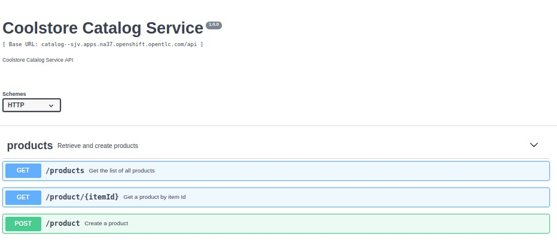
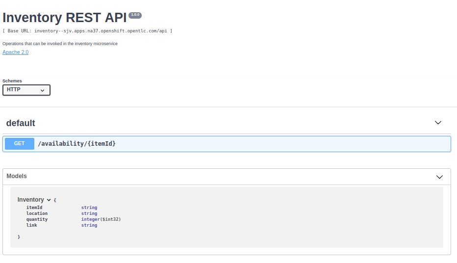

:scrollbar:
:data-uri:
:imagesdir: images
:toc2:

== Assignment Lab

.Goal
* Assess hands-on proficiency with Red Hat 3scale Development topics.

.Expectations
* Assignments take approximately 8 - 10 hours to complete.
* Assignments are an individual effort--complete the assignment without collaboration.
* Assignments should simulate a challenge typically encountered in a Red Hat consulting engagement.
** Assignment requirements are intentionally vague.

.Grading
* Minimum *75%* score needed to *PASS*.

.Criteria
* 25%: API Service Setup section
* 25%: Methods, Metrics, Rate Limits setup section
* 25%: User signup Setup section
* 25%: Development Portal & API Docs section

.Deliverables
* Provide a README with the following:
** Your 3scale Admin & Developer Portal environments (Host, Admin user/password, Developer signup link)
** Provide sufficient documentation for each section explaining your design choices.
** Sections without documentation will not be graded

.Environment
* You may choose where to deploy your solution
** If you have just completed the 3scale Implementation course or 3scale Development ILT, you may use the same environment for this assignment
** You can set up your own environment, but it must be accessible by the instructor
** You may use the OPENTLC shared environment, as during class

:numbered:

== Business Use Case

You are a consultant assigned to *_WebRetail Inc._*, an eCommerce hosting platform. They are developing a new Online Retail platform, branded *CoolStore*, for their partners to provide their catalog & inventory to be available for sale through the platform.

*_WebRetail Inc._* is adopting a new microservices architecture and wishes to make their retail platform APIs available as REST APIs. They have asked you to lead a proof-of-concept (POC) using Red Hat 3scale API Management Platform. The purpose of the POC is to determine the feasibility of using 3scale for managing their APIs, providing a standard portal for their partners to access the APIs, set up partner tier based plans, provide standard API Documentation & automated signup for the developers.

== Business Services

*_WebRetail Inc._* has made their *CoolStore Microservices Project* available to you. The available microservices are shared here:
https://github.com/jbossdemocentral/coolstore-microservice

You are provided additional collateral here:
https://github.com/gpe-mw-training/3scale_development_labs/tree/master/CoolStore

=== Business Services Provisioning

You will need to deploy the *Catalog* & *Inventory* services in your OpenShift project to enable these to be accessed by your 3scale API Management.

Below are the steps:

. Open a terminal window and login to your OCP admin console.

. Create a new project for your Products API business service applications:
+
-----
$ oc new-project $OCP_USERNAME-coolstore \
     --display-name="CoolStore API" \
     --description="CoolStore API Business Services"
-----

. Create a configmap for the catalog service:
+
-----
$ mkdir -p $HOME/lab

$ echo "
catalog.http.port: 8080
connection_string: mongodb://catalog-mongodb:27017
db_name: catalogdb
username: mongo
password: mongo" > $HOME/lab/app-config.yaml

$ oc create configmap app-config --from-file=$HOME/lab/app-config.yaml -n $OCP_USERNAME-coolstore
-----

. Allow default SA to read configmap deployed in namespace
+
-----
$ oc policy add-role-to-user view -z default -n $OCP_USERNAME-coolstore
-----

. Import the `coolstore` template to your OpenShift environment:
+
-----
$ oc create -f https://raw.githubusercontent.com/gpe-mw-training/3scale_development_labs/master/CoolStore/coolstore-catalog-mongodb-persistent.yaml -n $OCP_USERNAME-coolstore
-----

. Create a new application using the `coolstore` template:
+
-----
$ oc new-app \
        --template=coolstore-catalog-mongodb \
        -p CATALOG_DB_USERNAME=mongo \
        -p CATALOG_DB_PASSWORD=mongo \
        -n $OCP_USERNAME-coolstore
-----

. Wait about 1 minute for the mongodb to start and then resume the catalog-service from its paused state
+
-----
$ oc get pods
NAME                      READY     STATUS    RESTARTS   AGE
catalog-mongodb-1-zlsjx   1/1       Running   0          50s

$  oc rollout resume deploy/catalog-service -n $OCP_USERNAME-coolstore
-----

=== Explore the APIs

. Smoke test the APIs
.. Catalog service:
+
-----
$ curl -k http://`oc get route -n $OCP_USERNAME-coolstore  catalog-unsecured --template {{.spec.host}}`/products
-----

Notice that the Swagger spec is provided for both APIs. You can use the Swagger editor (http://editor.swagger.io/) to explore the APIs.

.Catalog API

.Inventory API

The following are the valid product ids seeded for this POC:

* 329299
* 329199
* 165613
* 165954
* 444434
* 444435
* 444436

You can try sample requests for the Catalog & Inventory APIs using the above product ids.

TIP: You can use the Swagger API docs to understand the methods & mappings required to be set up for the APIs in 3scale.

== POC Requirements

*_WebRetail Inc._* management requires that you include all of the items listed in these subsections in your POC.

=== Services

. Both the services *Inventory* & *Catalog* should be managed separately. 
. Each service should have a *basic* plan and a *premium* plan so that *_WebRetail Inc._* can provide differentiated plans to users.
. *basic* plan  should not have the ability to invoke CRUD operations on the services. 
* *premium* plan should not have impose any restrictions.
* *basic* plan users should be limited to only *5* API requests per hour for each service.
. Metrics should be set up such that usage details can be viewed for each method separately.

=== Developer Portal & User Experience

. Developers should be able to access a publicly hosted Developer Portal to access their application plans and API Documentation.
. The Developer Portal must be branded with the *CoolStore* logo and APIs.
. Only the 2 services *Inventory* & *Catalog* should be available for users to signup. 
. Developers should be able to choose their plans for each service and signup simultaneously to both services.
. If a developer chooses the *basic* plan, their plan should be approved automatically.
. If a developer chooses the *premium* plan, their plan should first be approved by *administrators* before they can access the APIs.
. API Docs should be available through the Developer Portal for developers to test the APIs.

=== API Gateway

. The API Gateway should be co-located with the services in the same OpenShift Project to reduce latency.
. API Gateway should expose separate routes for each service, so that management can micro-manage the availability of each service separately.
. API Gateway should expose *HTTP* endpoints to the APIs.
. Once the API services are exposed on the APICast gateway, the API backend routes should not have a publicly available URL that could be accessed directly.
. Production API route URLs should be provided to the management for testing.

== Homework Submittal

. You submit your homework via one of the following:
.. link:https://docs.google.com/document/d/1nxlvAOlSdNs3-y8AkmDjnc8vtCH9rJdI5zbN9deCK50/edit[Red Hat LMS^] if you are a Red Hat employee
.. link:https://partner.redhat.com[Red Hat Connect^] if you are a business partner

. To submit the assignment for grading, please upload a README file with the following information:

.. 3scale Admin Portal URL, admin userid/password
.. 3scale Developer Portal URL & signup page
.. Sample *curl* requests for each service at the *production* endpoint.
.. Any design considerations for each section describing your choices.
.. Any additional points/information relating to the assignment that you would like to share.
.. Any time limits (e.g environment expiry date) after which the solution is inaccessible for testing.
+
NOTE: Please have the lab environment accessible for upto 1 week after submission, to enable grader to access the URLs for grading.
